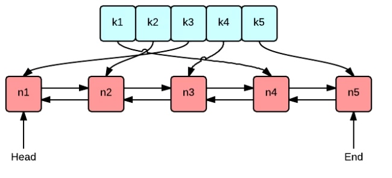
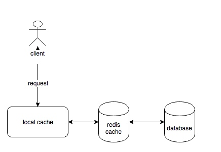
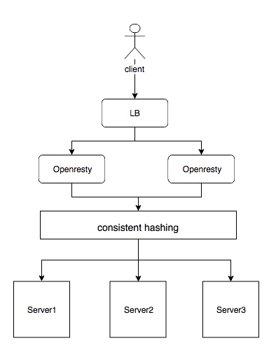

# 应用层缓存
## 前言
缓存系统是业务系统中常见的组件，在某些场景下技术需要保系统能够尽可能的快速响应，同时系统返回的资源又是很少被更改的，这时候可以使用缓存来提系统的响应速度。缓存系统从类型上来看可以分为内存型缓存和分布式缓存。第一种就是在程序内部使用的缓存，一般是一个map结构。第二种是通过网络请求存取资源的分布式缓存，比如redis-cluster，aerospike。内存型缓存虽然速度优于分布式缓存，但是它的容量有限，在要求不是特别高的情况下，可以直接选择分布式缓存以降低系统设计的复杂度。如果对速度要求极高，那么可以采取一些优化措施。

## LRU缓存
在内存型缓存中使用LRU结构来解决容量不足的问题，同时保证较高的命中率。LRU是一种cpu缓存管理算法，基本原理是：给每个缓存对象设置年龄，每次命中对象年龄加1，碰到需要更新缓存的情况，优先替换年龄最小的记录。但是在具体实现中一般不会严格去记录对象的生命周期，因为这样开销太大了。常见的LRU实现使用双向链表和哈希表，如下图所示：

链表中每个节点都记录前一个记录和后一个记录，使用head和tail来标记链表的头和尾。同时使用哈希表来存储记录，保证在获取操作的开销最小。当一个记录被命中，把它从链表中取出再连接到头部。当需要替换一个记录时，直接替换链表的最后一条记录。虽然没有严格记录每个记录的年龄，但是近似达到了LRU的效果。下面是scala版本的实现：

```
/**
  * Cache
  *
  * @author damon lin
  *         2018/3/22
  */
trait Cache[K,V] {

  def get(key: K): Option[V]

  def put(key: K, value: V): Unit

  def batchPut(values: Seq[(K, V)]): Unit

  def values(): Seq[V]

}

private[this] sealed trait Pointer[K, V] {
  var pre: Pointer[K, V]
  var next: Pointer[K, V]
}

private[this] case class Node[K, V](override var pre: Pointer[K, V], override var next: Pointer[K, V], key: K, value: V) extends Pointer[K, V]
private[this] case class NullNode[K, V](override var pre: Pointer[K, V], override var next: Pointer[K, V]) extends Pointer[K, V]

class LruCache[K, V](cap: Int) extends Cache[K, V] {

  require(cap > 0)

  def this() = this(10000) // default cap is 10000

  private[this] val map = new mutable.HashMap[K, Node[K, V]]
  private[this] val entries = new Array[Pointer[K, V]](cap)
  private[this] val head_ : NullNode[K, V] = NullNode(entries(0), entries(0))
  private[this] val tail_ : NullNode[K, V] = NullNode(entries(0), entries(0))
  private[this] val count = new AtomicInteger(1)

  entries(0) = head_
  entries(1) = tail_

  def batchPut(values: Seq[(K, V)]): Unit = {
    values.foreach {
      case (key, value) =>
        put(key, value)
    }
  }

  // todo: synchronized is not a efficient solution
  @ThreadSafe
  override def put(key: K, value: V): Unit = {
    this.synchronized {
      val index = count.get()
      if (index < cap - 1) {
        entries(index + 1) = tail_
        val n = newNode(key, value, index)
        map(key) = n
        count.incrementAndGet()
      } else {
        val old = tail_.pre.asInstanceOf[Node[K, V]]
        val n = Node(old.pre, old.next, key, value)
        tail_.pre = n
        map -= old.key
        map(key) = n
      }
    }
  }

  @ThreadSafe
  override def get(key: K): Option[V] =  {
    val n = map(key)
    // pick out n
    n.pre.next = n.next
    n.next.pre = n.pre
    // append n to head
    val h = head_.next
    n.next = h
    h.pre = n
    head_.next = n
    map.get(key).map(_.value)
  }

  override def values(): Seq[V] = {
    map.values.toList.map(_.value)
  }

  private[this] def newNode(key:K, value: V, index: Int) = {
    val pre = entries(index - 1)
    val next = entries(index + 1)
    val n = Node(pre, next, key, value)
    entries(index) = n
    pre.next = n
    next.pre = n
    n
  }
}
```
在实际使用中会碰到另外两个个问题：
1.如果没在数据库中查找到的资源是否应该被缓存呢？是的，对于无效的请求应该在缓存中记录，以减轻数据库的查询压力，同时可以防止恶意攻击。因为缓存了无效的记录，所以应该增加一种机制去定时剔除无效记录，以触发再次查询更新结果。
2.如何同步缓存数据和数据中的数据？有两种方法，第一种是在业务系统更改数据库时使用消息中间件（[或者数据自带的异步消息通道功能](https://github.com/digoal/blog/blob/master/201710/20171018_04.md)）通知缓存系统，缓存系统按需去获取更新。这种做法的好处是粒度很细，更新目标也很精确。缺点也很明显，缓存系统和业务系统耦合的太紧了，在每一处可能会引起更改的地方都需要显式的通知缓存系统。另外并不是所有被修改的数据都需要同步到缓存中的。第二种做法是主动拉取热点数据的更新，但是不能简单的重新初始化缓存，这样会造成缓存被击穿，短时间内会加大数据库的压力。一般选择使用异步的方式更新热点数据的存储记录，热点数据的定义可以灵活，比如所有缓存数据的前30%。

## 多级缓存
引入多级缓存。多级缓存的原理很好理解，和cpu的多级缓存设计一样，在应用层同时引入内存型缓存和分布式缓存。因为读数据库的开销要远远大于读分布式缓存的开销，所以多级缓存能提高性能。


## 分片
分片不能提高记录的访问速度，但是能够提高系统整体的吞吐量。系统架构设计如下如所示：

在服务前引入openresty，采用一致性哈希算法做负载均衡。这样对于同样的url能够定向到同一台服务器上，相比随机算法，一致性哈希能够大大提高缓存的命中率，能够减少因为命中失败引起的网络请求。但是分片后会带来另一个问题：数据热点。因为一致性哈希是根据url来重定向请求的，可能会发生大量请求被转到同一台服务器上，导致服务瘫痪。解决方案是降级处理热点请求，在LB后面引入一层openresty，对于热点请求降级为随机算法。

## 小结
应用层缓存可以提供系统响应速度，对于一些不经常被更改的资源可以加入缓存系统。使用LRU解决内存型缓存的容量问题，引入多级缓存可以优化内存型缓存失效的场景。而对于一些量级很大的资源，引入分片机制增加系统吞吐量。

