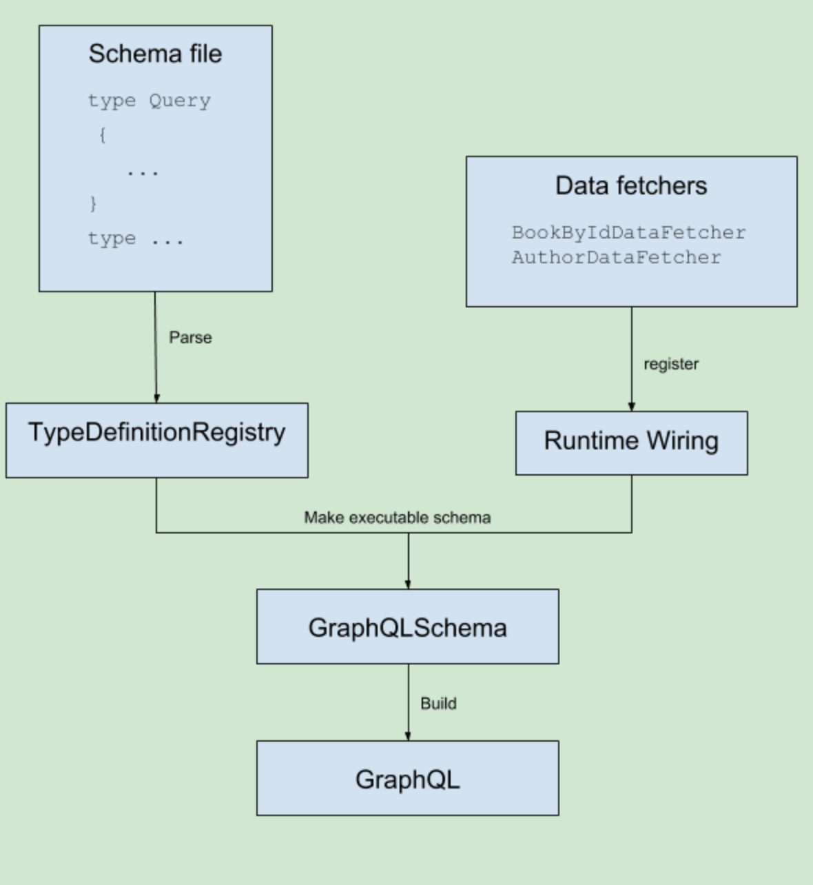

#  GraphQL Java
GraphQL是一种查询语言，用于从服务器检索数据。它以某种方式替代了REST，SOAP或gRPC。GraphQL Java是 GraphQL 的 Java（服务器）实现。创建GraphQL Java服务器的主要步骤是：
- 定义 GraphQL 模式。
- 定义 DataFetchers，确定如何获取查询的实际数据。
- 绑定  GraphQL 模式和 DataFetchers。

## 实战
假设我们要从在线商店后端查询特定书籍的详细信息。使用GraphQL，可以将以下查询发送到服务器，以获取ID为“ book-1”的图书的详细信息：
```
{
  bookById(id: "book-1"){
    id
    name
    pageCount
    author {
      firstName
      lastName
    }
  }
}
```
这不是JSON（即使看起来故意相似），它是GraphQL查询语法。它基本上说：
- 查询具有特定ID的书
- 从那本书中获取ID，名称，pageCount和作者
- 对于作者，我想知道名字和姓氏

获得的响应是普通的JSON：
```
{ 
  "bookById":
  {
    "id":"book-1",
    "name":"Harry Potter and the Philosopher's Stone",
    "pageCount":223,
    "author": {
      "firstName":"Joanne",
      "lastName":"Rowling"
    }
  }
}
```
GraphQL的一个非常重要的特性是它是静态类型的：服务器确切地知道可以查询的每个对象的形状，并且任何客户端实际上都可以“理解”服务器并请求所谓的“模式”。该模式描述了哪些查询是可能的，以及您可以取回哪些字段。上述例子的 Graphql 模式如下所示：
```
type Query {
  bookById(id: ID): Book 
}

type Book {
  id: ID
  name: String
  pageCount: Int
  author: Author
}

type Author {
  id: ID
  firstName: String
  lastName: String
}
```
文件定义了一个顶级字段（类型为Query）： bookById它返回特定书籍的详细信息。它还定义了类型Book，其具有以下字段：id，name，pageCount和author。 以及作者的类型 author。

拥有此文件后，我们需要通过读取文件并对其进行解析，生成 graphql 查询实例：
```
@Component
public class GraphQLProvider {

    private GraphQL graphQL;

    @Bean
    public GraphQL graphQL() { 
        return graphQL;
    }

    @PostConstruct
    public void init() throws IOException {
        // 解析文件
        URL url = Resources.getResource("schema.graphqls");
        String sdl = Resources.toString(url, Charsets.UTF_8);
        GraphQLSchema graphQLSchema = buildSchema(sdl);
        this.graphQL = GraphQL.newGraphQL(graphQLSchema).build();
    }

    private GraphQLSchema buildSchema(String sdl) {
      // TODO: we will create the schema here later 
    }
}
```
上述代码中 buildSchema 会绑定 data fetcher 和 scheme 中的查询字段，创建 GraphQLSchema 实例：
```
    @Autowired
    GraphQLDataFetchers graphQLDataFetchers;

    private GraphQLSchema buildSchema(String sdl) {
        TypeDefinitionRegistry typeRegistry = new SchemaParser().parse(sdl);
        RuntimeWiring runtimeWiring = buildWiring();
        SchemaGenerator schemaGenerator = new SchemaGenerator();
        return schemaGenerator.makeExecutableSchema(typeRegistry, runtimeWiring);
    }

    // 组装查询方法和 scheme
    private RuntimeWiring buildWiring() {
        return RuntimeWiring.newRuntimeWiring()
                .type(newTypeWiring("Query")
                        .dataFetcher("bookById", graphQLDataFetchers.getBookByIdDataFetcher())) // bookById 实际的代码
                .type(newTypeWiring("Book")
                        .dataFetcher("author", graphQLDataFetchers.getAuthorDataFetcher()))
                .build();
    }
```
TypeDefinitionRegistry 是 scheme 文件的解析器。SchemaGenerator 结合 TypeDefinitionRegistry 和 RuntimeWiring 生成 GraphQLSchema 实例。

## 数据提取器
GraphQL Java 最重要的概念可能是 DataFetcher。GraphQL Java 执行查询时，DataFetcher 为查询中遇到的每个字段调用适当的 DataFetcher。 DataFetcher 是具有单个方法的接口，采用单个类型的参数DataFetcherEnvironment：
```
public interface DataFetcher<T> {
    T get(DataFetchingEnvironment dataFetchingEnvironment) throws Exception;
}
```
重要提示：模式中的每个字段都有一个DataFetcher关联。如果没有关联，则使用默认值PropertyDataFetcher。我们将在后面详细讨论。GraphQLDataFetchers 中包含书籍和作者的示例列表。完整的实现如下所示：
```
@Component
public class GraphQLDataFetchers {

    private static List<Map<String, String>> books = Arrays.asList(
            ImmutableMap.of("id", "book-1",
                    "name", "Harry Potter and the Philosopher's Stone",
                    "pageCount", "223",
                    "authorId", "author-1"),
            ImmutableMap.of("id", "book-2",
                    "name", "Moby Dick",
                    "pageCount", "635",
                    "authorId", "author-2"),
            ImmutableMap.of("id", "book-3",
                    "name", "Interview with the vampire",
                    "pageCount", "371",
                    "authorId", "author-3")
    );

    private static List<Map<String, String>> authors = Arrays.asList(
            ImmutableMap.of("id", "author-1",
                    "firstName", "Joanne",
                    "lastName", "Rowling"),
            ImmutableMap.of("id", "author-2",
                    "firstName", "Herman",
                    "lastName", "Melville"),
            ImmutableMap.of("id", "author-3",
                    "firstName", "Anne",
                    "lastName", "Rice")
    );

    public DataFetcher getBookByIdDataFetcher() {
        return dataFetchingEnvironment -> {
            String bookId = dataFetchingEnvironment.getArgument("id");
            return books
                    .stream()
                    .filter(book -> book.get("id").equals(bookId))
                    .findFirst()
                    .orElse(null);
        };
    }

    public DataFetcher getAuthorDataFetcher() {
        return dataFetchingEnvironment -> {
            Map<String,String> book = dataFetchingEnvironment.getSource();
            String authorId = book.get("authorId");
            return authors
                    .stream()
                    .filter(author -> author.get("id").equals(authorId))
                    .findFirst()
                    .orElse(null);
        };
    }
}
```
我们从班级内部的静态列表中获取书籍和作者，这仅是针对本教程进行的。GraphQL 并不依赖数据的来源，数据可以来自静态内存列表，数据库或外部服务。

DataFetcher 可以从 dataFetchingEnvironment 中获取参数，从第二级 DataFetcher 开始可以获取父级查询返回的完整的对象，比如 getAuthorDataFetcher 方法可以获得上级查询的 book 对象。除了自定义的 DataFetcher 普通属性都有一个默认的 DataFetcher。比如 Book.id，Book.name，都有一个默认的 PropertyDataFetcher 与它相关联。一个 PropertyDataFetcher 会试图查找 Java 对象的属性。
## 小结
总体上，创建GraphQL和GraphQLSchema实例的过程如下所示：
