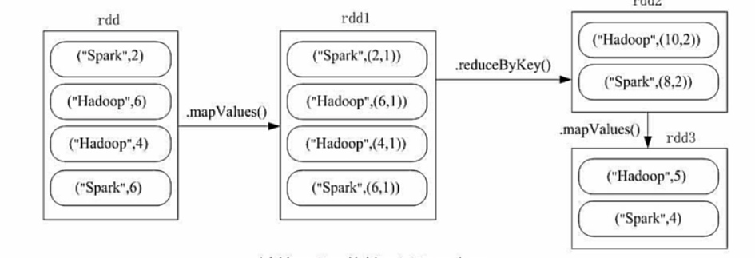
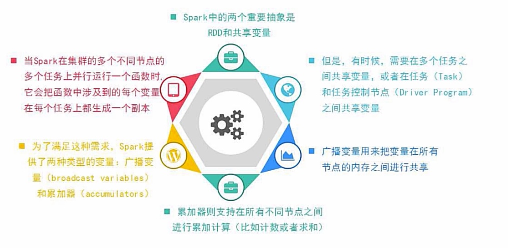
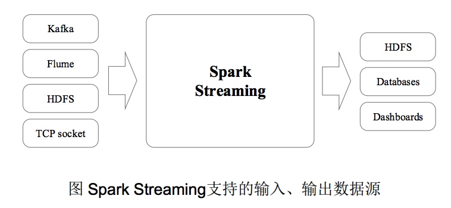
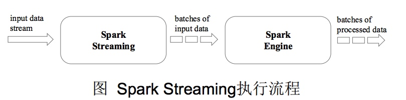
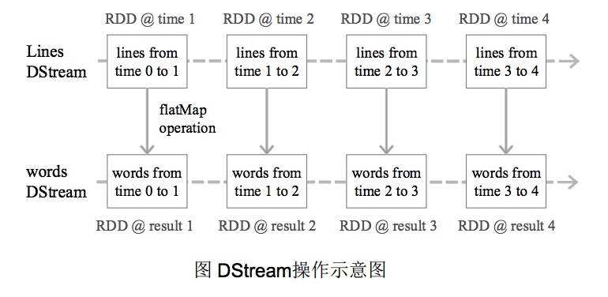
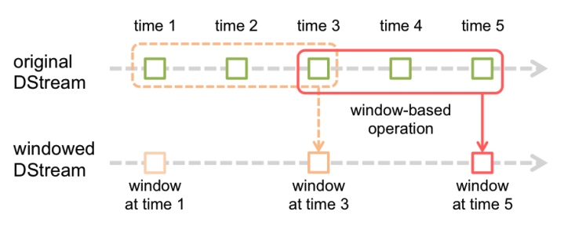
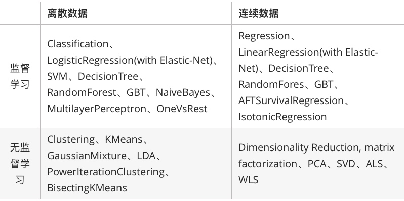
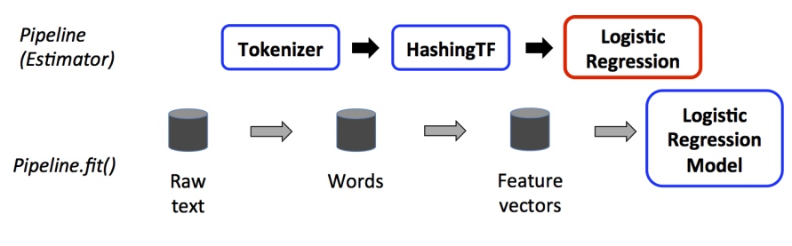

# Spark 101

## 常用操作
```
val l = List("hadoop", "spark", "hbase","hadoop")
val lp = sc.parallelize(l)
val lm = lp.map(l => (l,1))
```
* groupByKey([numPartitions])：根据key进行分组聚合，由(K, V) 得到 (K, Iterable<V>) 

```
lm.groupByKey().map(p=>p._2).collect
res8: Array[Iterable[Int]] = Array(CompactBuffer(1), CompactBuffer(1), CompactBuffer(1, 1))
```
* reduceByKey(func, [numPartitions])：根据key进行分组聚合，同时使用一个函数对分组后的value进行聚合。由(K, V) 得到 (K, Reduce_V)

```
lm.reduceByKey(_ + _).sortBy(p => p._2).collect
res12: Array[(String, Int)] = Array((hbase,1), (spark,1), (hadoop,2))
```
* join(otherDataset, [numPartitions])：内连接操作，给定两个两个集合 (K, V) 和 (K, W), 返回(K, (V, W))。对应的外链接操作leftOuterJoin, rightOuterJoin, fullOuterJoin

```
val lp2 = sc.parallelize(Array("spark","fast","hbase"))
lm.join(lp2.map(p => (p,1))).collect
res16: Array[(String, (Int, Int))] = Array((hbase,(1,1)), (spark,(1,1)))
```
一个综合例子：

```
rdd.mapValues(x => (x,1)).reduceByKey((x,y) => (x._1+y._1,x._2+y._2)).mapValues(x=>(x._1/x._2)).collect
res21: Array[(String, Int)] = Array((spark,4), (hadoop,5))
```


## 共享变量
Spark中有两种类型的共享变量：一个是累加器accumulator，一个是广播变量broadcast variable。


累加器用来对信息进行聚合，一个常见用途是在调试时对作业执行过程中的事件进行计数，如：统计日志中空行数、统计错误行数等。

```
scala> val accum = sc.longAccumulator("My Accumulator")

scala> sc.parallelize(Array(1, 2, 3, 4)).foreach(x => accum.add(x))

scala> accum.value
res2: Long = 10
```
广播变量用来高效分发较大的对象，可以让程序高效地向所有工作节点发送一个较大的只读值，以供一个或多个 Spark 操作使用。

```
scala> val broadcastVar = sc.broadcast(Array(1, 2, 3))
broadcastVar:org.apache.spark.broadcast.Broadcast[Array[Int]] = Broadcast(0)

scala> broadcastVar.value
res0: Array[Int] = Array(1, 2, 3)
```
# Spark SQL
Spark SQL 增加了DataFrame（即带有schema信息的RDD），使用户可以在Spark SQL中执行SQL语句，数据既可以来自RDD，也可以是Hive，HDFS，Cassandra等外部数据源。

* RDD是分布式的 Java对象的集合，但是，对象内部结构对于RDD而言却是不可知的
* DataFrame是一种以RDD为基础的分布式数据集，提供了详细的结构信息

例子：

```
scala> import org.apache.spark.sql.SparkSession
scala> val spark=SparkSession.builder().getOrCreate()
scala> import spark.implicits._

scala> val df = spark.read.json("file:////Users/damon/Documents/WorkSpace/Open-Source/bigdata/spark-2.1.1-GIO1.0.0-bin-2.7.3/examples/src/main/resources/people.json")

scala> df.show()
+----+-------+
| age|   name|
+----+-------+
|null|Michael|
|  30|   Andy|
|  19| Justin|
+----+-------+

scala> df.select(df("name"),df("age")+1).show()
+-------+---------+
|   name|(age + 1)|
+-------+---------+
|Michael|     null|
|   Andy|       31|
| Justin|       20|
+-------+---------+

scala> df.filter(df("age") > 20).show()
+---+----+
|age|name|
+---+----+
| 30|Andy|
+---+----+

```
从RDD生成DataFrame有两种方式，第一种是使用case class结合反射机制，第二种是显示编程指定DataFrame的结构。

```
scala> case class Person(name: String, age: Long) 

scala> val peopleDF =
spark.sparkContext.textFile("file:///usr/local/spark/examples/src/main/resources/people.txt").map(_.split(",")).map(attributes
=> Person(attributes(0), attributes(1).trim.toInt)).toDF()

scala> peopleDF.createOrReplaceTempView(“people”) //必须注册为临时表才能供下面的查询使用

scala> val personsRDD = spark.sql("select name,age from people where age > 20") //最终生成一个DataFrame

scala> personsRDD.map(t => “Name:”+ t(0) + “,” + “Age:” + t(1)).show() //DataFrame中的每个元素都是一行记录，包含name和age两个字段，分别用t(0)和t(1)来获取值
+------------------+
| value|
+------------------+
|Name:Michael,Age:29|
| Name:Andy,Age:30|
+------------------+
```
当无法提前定义case class时，就需要采用编程方式定义RDD模式

```
scala> import org.apache.spark.sql.types._
scala> import org.apache.spark.sql.Row
scala> val peopleRDD = spark.sparkContext.textFile("file:///usr/local/spark/examples/src/main/resources/people.txt")

//定义一个模式字符串
scala> val schemaString = "name age"

//根据模式字符串生成模式
scala> val fields = schemaString.split(" ").map(fieldName =>
StructField(fieldName, StringType, nullable = true))

scala> val schema = StructType(fields)

//对peopleRDD 这个RDD中的每一行元素都进行解析
scala> val rowRDD = peopleRDD.map(_.split(",")).map(attributes =>
Row(attributes(0), attributes(1).trim))

scala> val peopleDF = spark.createDataFrame(rowRDD,
schema)
```

# Spark Streaming
Spark Streaming可整合多种输入数据源，如Kafka、Flume、HDFS，甚至是普通的TCP套接字。经处理后的数据可存储至文件系统、数据库，或显示在仪表盘里。


Spark Streaming的基本原理是将实时输入数据流以时间片（秒级）为单位进行拆分，然后经Spark引擎以类似批处理的方式处理每个时间片数据。

Spark Streaming最主要的抽象是DStream（Discretized Stream，离散化数据流），表示连续不断的数据流。在内部实现上，Spark Streaming的输入数据按
照时间片（如1秒）分成一段一段，每一段数据转换为Spark中的RDD，这些分段就是Dstream，并且对DStream的操作都最终转变为对相应的RDD的操作。


```
import org.apache.spark._
import org.apache.spark.streaming._
object WordCountStreaming {
def main(args: Array[String]) {
val sparkConf = new SparkConf().setAppName("WordCountStreaming").setMaster("local[2]")//设置为本地运行模式，2个线程，一个监听，另一个处理数据

val ssc = new StreamingContext(sparkConf, Seconds(2))// 时间间隔为2秒

val lines = ssc.textFileStream("file:///usr/local/spark/mycode/streaming/logfile") //这里采用本地文件，当然你也可以采用HDFS文件

val words = lines.flatMap(_.split(" "))
val wordCounts = words.map(x => (x, 1)).reduceByKey(_ + _)
wordCounts.print()
ssc.start()
ssc.awaitTermination()
}
} 
```
对Dstream的转换操作又分为有状态的和无状态的，无状态的比较简单，表示只对当前这个Dstream进行操作，不涉及历史数据。有状态的转换即设置一个滑动窗口，每次窗口停放的位置上，都会有一部分Dstream（或者一部分RDD）被框入窗口内，形成一个小段的Dstream。


# Spark MLLib
Spark提供了一个基于海量数据的机器学习库，它提供了常用机器学习算法的分布式实现。开发者只需要有Spark 基础并且了解机器学习算法的原理，以及方法相关参数的含义，就可以轻松的通过调用相应的 API 来实现基于海量数据的机器学习过程。MLlib是Spark的机器学习（Machine Learning）库，旨在简化机器学习的工程实践工作，MLlib由一些通用的学习算法和工具组成，包括分类、回归、聚类、协同过滤、降维等，同时还包括底层的优化原语和高层的工作流（Pipeline）API，具体如下：

* 算法工具：常用的学习算法，如分类、回归、聚类和协同过滤
* 特征化工具：特征提取、转化、降维和选择工具
* 工作流(Pipeline)：用于构建、评估和调整机器学习工作流的工具
* 持久性：保存和加载算法、模型和管道
* 实用工具：线性代数、统计、数据处理等工具

MLlib目前支持4种常见的机器学习问题: 分类、回归、聚类和协同过滤。


机器学习工作流概念：

* DataFrame：使用Spark SQL中的DataFrame作为数据集，它可以容纳各种数据类型。
* Transformer：翻译成转换器，是一种可以将一个DataFrame转换为另一个DataFrame的算法。
* Estimator：翻译成估计器或评估器，它是学习算法或在训练数据上的训练方法的概念抽象。
* Parameter：Parameter 被用来设置 Transformer 或者Estimator 的参数。
* PipeLine：翻译为工作流或者管道。工作流将多个工作流阶段（转换器和估计器）连接在一起，形成机器习的工作流，并获得结果输出。

一个典型的工作流例子：输入是文本，使用分词器提取单词，使用hashingTF提取特征，最后使用logistic regression 评估器训练得到最终的模型。


代码：

```
import org.apache.spark.ml.{Pipeline, PipelineModel}
import org.apache.spark.ml.classification.LogisticRegression
import org.apache.spark.ml.feature.{HashingTF, Tokenizer}
import org.apache.spark.ml.linalg.Vector
import org.apache.spark.sql.Row

// 训练数据
val training = spark.createDataFrame(Seq(
  (0L, "a b c d e spark", 1.0),
  (1L, "b d", 0.0),
  (2L, "spark f g h", 1.0),
  (3L, "hadoop mapreduce", 0.0)
)).toDF("id", "text", "label")

// 分词器
val tokenizer = new Tokenizer()
  .setInputCol("text")
  .setOutputCol("words")
// 特征工具
val hashingTF = new HashingTF()
  .setNumFeatures(1000)
  .setInputCol(tokenizer.getOutputCol)
  .setOutputCol("features")
// 逻辑回归模型
val lr = new LogisticRegression()
  .setMaxIter(10)
  .setRegParam(0.001)
// 构建pipline  
val pipeline = new Pipeline()
  .setStages(Array(tokenizer, hashingTF, lr))

// 训练模型
val model = pipeline.fit(training)

// 训练数据
val test = spark.createDataFrame(Seq(
  (4L, "spark i j k"),
  (5L, "l m n"),
  (6L, "spark hadoop spark"),
  (7L, "apache hadoop")
)).toDF("id", "text")

// 使用模型
model.transform(test)
  .select("id", "text", "probability", "prediction")
  .collect()
  .foreach { case Row(id: Long, text: String, prob: Vector, prediction: Double) =>
    println(s"($id, $text) --> prob=$prob, prediction=$prediction")
  }
```

