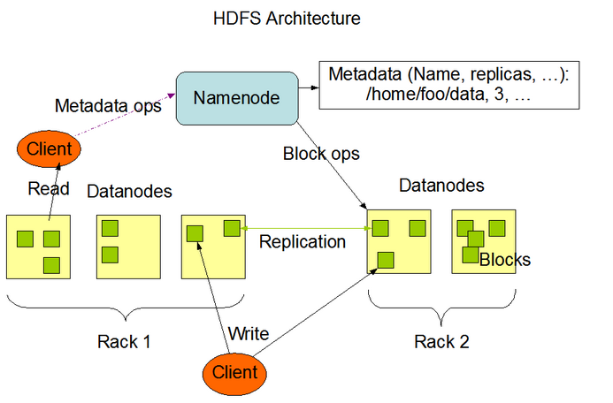
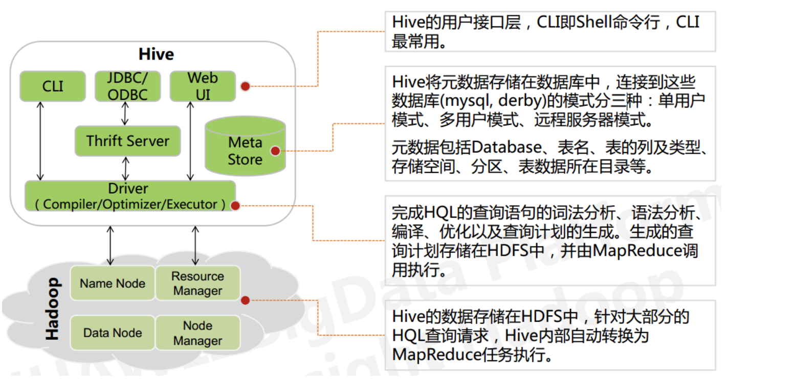

# Overview

## CAP

- Consistency 一致性，写操作之后的读操作，必须返回该值。
- Availability 可用性，意思是只要收到用户的请求，服务器就必须给出回应。
- Partition tolerance 分区容错，分区容错的意思是，区间通信可能失败。

一般来说，分区容错无法避免，因此可以认为 CAP 的 P 总是成立。CAP 定理告诉我们，剩下的 C 和 A 无法同时做到。

一致性和可用性，为什么不可能同时成立？答案很简单，因为可能通信失败（即出现分区容错）。
如果保证 G2 的一致性，那么 G1 必须在写操作时，锁定 G2 的读操作和写操作。只有数据同步后，才能重新开放读写。锁定期间，G2 不能读写，没有可用性不。
如果保证 G2 的可用性，那么势必不能锁定 G2，所以一致性不成立。
综上所述，G2 无法同时做到一致性和可用性。系统设计时只能选择一个目标。如果追求一致性，那么无法保证所有节点的可用性；如果追求所有节点的可用性，那就没法做到一致性。

## OLAP vs OLTP
数据处理大致可以分成两大类：联机事务处理OLTP（on-line transaction processing）、联机分析处理OLAP（On-Line Analytical Processing）。OLTP是传统的关系型数据库的主要应用，主要是基本的、日常的事务处理，例如银行交易。OLAP是数据仓库系统的主要应用，支持复杂的分析操作，侧重决策支持，并且提供直观易懂的查询结果。 

## 存储
### HDFS
HDFS 是 hadoop 中的分布式文件系统。HDFS 由 NameNode、SecondaryNameNode、DataNode 三个组件组成。

- Name Node 存放文件元信息，包括文件的路径、所有者、组成的块，但是不包括块 block 的位置。
- Name Node 会在启动的时候从 DataNode 获取 block 信息，将 block 信息保存在内存中加速访问。
- SecondaryNameNode 主要是用于定期合并 fsimage（元信息的文件） 和 edits 防止 edits 过大用的，不是 NameNode 备份。
- DataNode 存储 block 数据，负责接收 NameNode 指令操作 blcok。同时也直接和 client 对接提供读写服务。

结构图

读取过程
1. client 读取 NameNode 获取 block 信息
2. client 向 DataNode 获取 block 数据
3. 关闭连接完成读取

写入过程
1. client 请求 NameNode 获取写入 DataNode
2. DataNode 接受来自 client 的文件
3. DataNode 将文件复制到另外两个 DataNode，完成后返回结果到 NameNode
4. 如果某个 DataNode 写入失败，NameNode 会重新选择 DataNode 写入。
5. 所有写入完成后会计算每个 block 的校验和并存放在 hdfs 中。

删除过程
1. NameNode 将文件放入 /trash 目录，真实数据不删除。
2. NameNode 定期清理命名空间中的数据。

设计目标
- 为 GB、PB 级别大小的文件设计
- 完善的容错机制，能跑在廉价的 pc 上

不适用
- 海量小文件存储
- 低延迟文件读取
- 多用户随机写入

### Parquet

### CarbonData

### Hive
Hive 是构建在 hadoop 上的数据仓库。底层数据存储在 hdfs 上，对外提供 HQL 语言查询。Hive 的本质是将 HQL 转化为 MapReduce 任务去运行。

架构：

hive 的优点：
- 构建在 hdfs 之上，横向可扩展。
- 完整的 SQL 实现，支持自定义函数，可以扩展 HQL 语法。
- 良好的容错性，部分节点宕机仍可完成 SQL 操作

缺点：
- 不支持修改数据，用户可以将查询结果重新导入到新的文件中。
- 查询延迟比较严重，MapReduce 启动过程非常耗时。
- 不支持事务

Hive 中的表只是逻辑表的声明，即表的元数据。Hive 本身不存储数据，底层依赖于 hdfs 和 MapReduce 之上。Hive 中的表操作换被翻译为 MapReduce 操作，这样就能将逻辑表映射为数据库表。因为依赖 MapReduce 操作，所以 hive 是以行来处理数据的，不适合随机海量数据访问，只适合处理海量数据联机分析（OLAP）场景。

### Kudu

### Hbase

## 计算
### MapReduce

### Spark

### Flink

## 查询

### Phoenix

### Impala

### Presto

### Druid