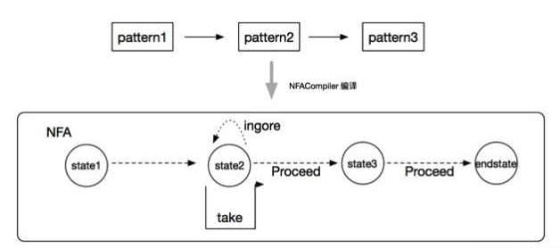
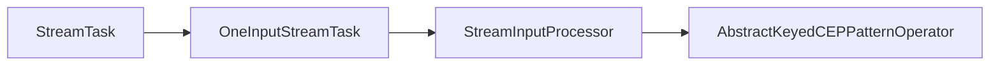
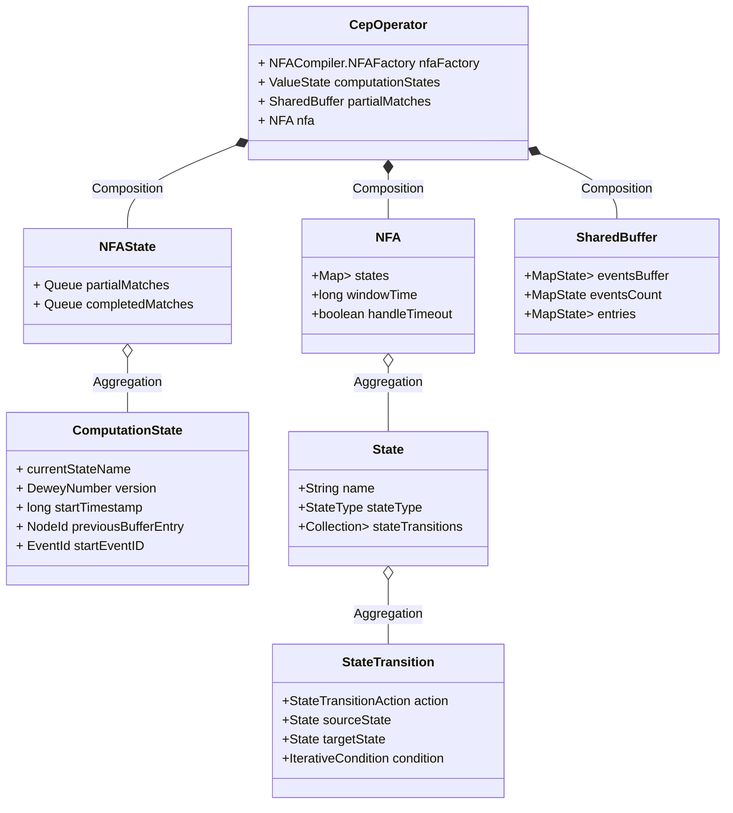
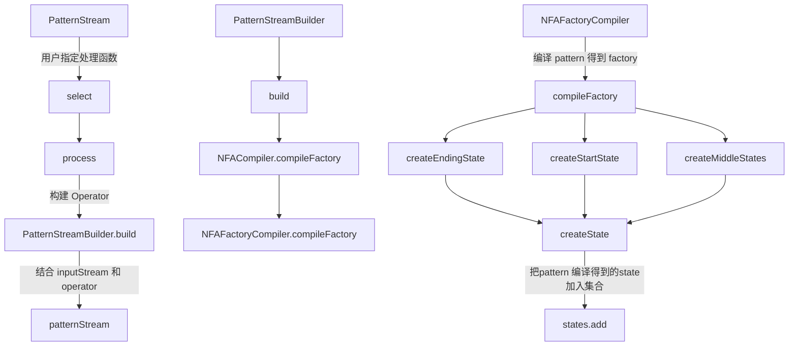
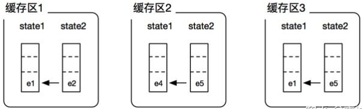
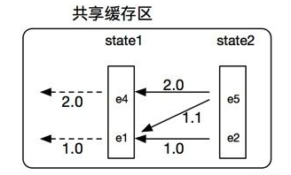
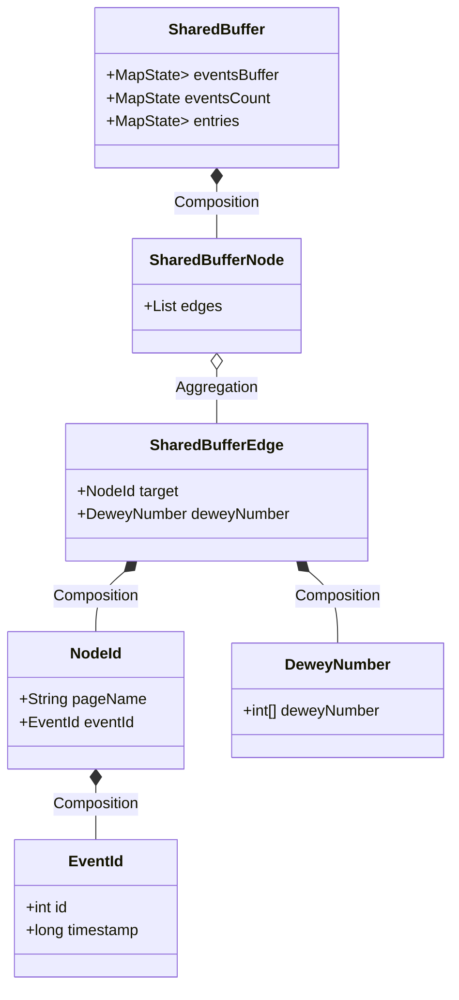
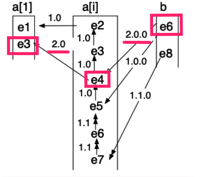
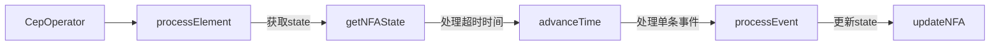
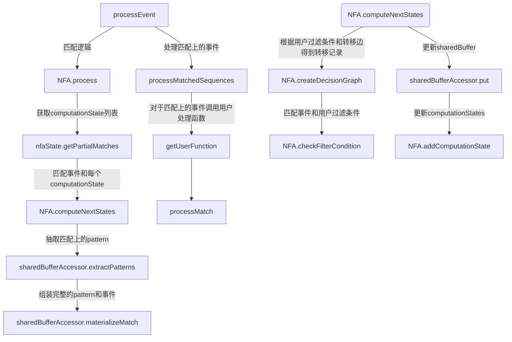

# Flink CEP 源码分析
# CEP 基本实现原理
CEP基本实现原理是模式匹配，过程就是状态转换的过程，每个状态(state)可以理解成由Pattern构成，为了从当前的状态转换成下一个状态，用户可以在Pattern上指定条件，用于状态的过滤和转换。首先需要用户创建定义一个个pattern，然后通过链表将由前后逻辑关系的pattern串在一起，构成模式匹配的逻辑表达。CEP 使用 NFACompiler 创建出NFA(非确定有限自动机)对象，NFA包含了该次模式匹配的各个状态和状态间转换的表达式。整个示意图就像如下：


三种状态变更：
- Take: 表示事件匹配成功，将当前状态更新到新状态，并前进到“下一个”状态；
- Procceed: 当事件来到的时候，当前状态不发生变化，在状态转换图中事件直接“前进”到下一个目标状态；
- IGNORE: 当事件来到的时候，如果匹配不成功，忽略当前事件，当前状态不发生任何变化。

# 调用流程
## 单任务内调用流程：


## 数据结构
Pattern 是用户定义的匹配模式，主要由匹配规则（condition）、循环策略（quantifier，times）、匹配后跳过策略（afterMatchSkipStrategy）等组成。
```
// 用户定义的匹配模式
public class Pattern<T, F extends T> {
    // pattern 名称
	private final String name;
	// 上一个 pattern
	private final Pattern<T, ? extends T> previous;
	// pattern 匹配规则
	private IterativeCondition<F> condition;
	// pattern 有效时间
	private Time windowTime;
    // 循环匹配策略 默认是严格连续匹配
	private Quantifier quantifier = Quantifier.one(ConsumingStrategy.STRICT);
	// 停止条件
	private IterativeCondition<F> untilCondition;
    // pattern 重复次数
	private Times times;
	// pattern 跳过策略
	private final AfterMatchSkipStrategy afterMatchSkipStrategy;
}
```
当用户调用pattern 的 next、followBy 等组合函数，实际是生成了一个新的 pattern ，同时使用 previous 指向前一个 pattern，最后得到的是一个链表，末尾节点的pattern。
```
// 默认是严格匹配 继承了上一个pattern的跳过策略
public Pattern<T, T> next(final String name) {
		return new Pattern<>(name, this, ConsumingStrategy.STRICT, afterMatchSkipStrategy);
	
}
```
 CEP 的操作符是一个 OneInputStreamOperator 的具体实现。增加了 nfaFactory（nfa 工厂）、NFAState、SharedBuffer、NFA实例。
```
public class CepOperator {
	// 编译流程生成的 nfa 工厂 由 NFACompiler 结合 pattern 生成
	private final NFACompiler.NFAFactory<IN> nfaFactory;
	
	// 当前 nfa 匹配状态 
	// 是一个 ValueState 由 flink runtime 管理存储
	private transient ValueState<NFAState> computationStates;

	// ？
	private transient MapState<Long, List<IN>> elementQueueState;

	// 部分匹配的状态 由 SharedBuffer 存储
	private transient SharedBuffer<IN> partialMatches;
	
	// NFA 实例 由 nfaFactory 创建而来 存储匹配规则
	private transient NFA<IN> nfa;
}
```
nfaFactory 由 NFACompiler 编译 pattern 而来：
```
final NFACompiler.NFAFactory<IN> nfaFactory = NFACompiler.compileFactory(pattern, timeoutHandling);

```
而NFA实例是在算子初始化的时候由工厂生成的：
```
nfa = nfaFactory.createNFA();
```
 ```mermaid
 graph LR
 CepOperator--初始化-->open--使用 factory 得到 nfa 实例-->nfaFactory.createNFA;
```
NFA状态机主要存储由用户 pattern 编译而来的匹配规则：
```
// NFA状态机实例 实际使用的匹配状态机
public class NFA<T> {
	// NFACompiler 编译用户 pattern 得到的节点状态集合
	private final Map<String, State<T>> states;
	// Pattern.within(Time) 设置
	private final long windowTime;
	// 是否处理超时
	private final boolean handleTimeout;
}
```
每个pattern会被编译为一个state节点，每个节点有节点类型（起点、终点、普通）、匹配转移规则（stateTransitions）。
```
// 代表一个状态节点
public class State<T> implements Serializable {
	private static final long serialVersionUID = 6658700025989097781L;

	private final String name; // 当前状态名称
	private StateType stateType; // 节点类型
	
	// 状态转移边
	private final Collection<StateTransition<T>> stateTransitions; 

    public void addStateTransition(
			final StateTransitionAction action,
			final State<T> targetState,
			final IterativeCondition<T> condition) {
		stateTransitions.add(new StateTransition<T>(this, action, targetState, condition));
	}

	public enum StateType {
		Start, // NFA的起点状态
		Final, // NFA的终点状态
		Normal, // NFA的普通节点
		Stop
}
}

// 状态转移边
public class StateTransition<T> implements Serializable {
    private static final long serialVersionUID = -4825345749997891838L;
    private final StateTransitionAction action; // 转移动作
    private final State<T> sourceState; // 源状态节点
    private final State<T> targetState; // 目标状态节点
    private IterativeCondition<T> condition; // 转移需要满足的条件

	public enum StateTransitionAction {
		TAKE, // take the current event and assign it to the current state
		IGNORE, // ignore the current event
		PROCEED // do the state transition and keep the current event for further 
  }
}
```


由 pattern 编译为 state和state transition 的过程：

State、NFA 都是存储的用户定义的匹配规则，而计算中产生的部分匹配记录以及已经完成的匹配记录全部由NFAState存储：
```

// NFA 有限状态机当前状态存储结构
public class NFAState {
    // 匹配到一半的节点
	private Queue<ComputationState> partialMatches;
	// 完成匹配的节点
	private Queue<ComputationState> completedMatches;
	//状态是否变更
	private boolean stateChanged;
}

// 每个ComputationState代表一个正在匹配中的规则
// 
public class ComputationState {
	// 指向当前匹配到 state 名称
	private final String currentStateName;
    // 杜威路径编号 用于在 sharedBuffer 查找完整的匹配链路
	private final DeweyNumber version;
	private final long startTimestamp;
	// sharedBuffer中匹配节点的前一个节点
	@Nullable
	private final NodeId previousBufferEntry;
	// sharedBuffer中匹配路径的其实节点
	@Nullable
	private final EventId startEventID;
}

```

## SharedBuffer 实现
为什么需要引入sharedBuffer，如果对每个部分匹配链都独立存储是比较浪费空间的，比如下面的例子：



(e1,e2) 和 (e1,e5) 有共同的前缀，在实际的模式匹配场景下，每个缓冲区独立维护的堆栈中可能会有大量的数据重叠。随着流事件的不断流入，为每个匹配结果独立维护缓存区占用内存会越来越大。为了优化存储，flink CEP 提出了共享缓存区的概念(SharedBuffer),就是用一个共享的缓存区来表示上面三个缓存区。



上面的sharedBuffer 表示了三个部分匹配，分别是：
- e4 <-- e5
- e1 <-- e5
- e1 <-- e2

SharedBuffer 数据结构：

主要由节点和边构成。
```
public class SharedBuffer<V> {
	// 存储 EventId 和 Event（真实事件）映射关系
	private MapState<EventId, Lockable<V>> eventsBuffer;
	// (timestamp - 个数) 用于产生EventId
	private MapState<Long, Integer> eventsCount; 
	// 主要部分：节点 - 边
	private MapState<NodeId, Lockable<SharedBufferNode>> entries;
}
```
每个节点存储该节点关联的所有边，边由目标节点和杜威编号组成：
```
// 匹配节点
public class SharedBufferNode {
    private final List<SharedBufferEdge> edges; // 每个点关联的所有边
}
// 单向边
public class SharedBufferEdge {
	private final NodeId target; // 关联节点
	private final DeweyNumber deweyNumber; // 杜威十进制分类法
}
// 节点编号
public class NodeId {
	private final String pageName; // 用户定义的节点名称
	private final EventId eventId; // 事件编号
}
// 事件编号
public class EventId implements Comparable<EventId> {
	private final int id; // 对应timestamp到达的事件个数编号
	private final long timestamp;
}

```
EventId 事件编号指的是对同一个timestamp内同时到达的事件进行计数编号：
```
EventId registerEvent(V value, long timestamp) throws Exception {
		Integer id = eventsCount.get(timestamp);
		if (id == null) {
			id = 0;
		}
		EventId eventId = new EventId(id, timestamp);
		Lockable<V> lockableValue = new Lockable<>(value, 1);
		// 同一个 timestamp
		eventsCount.put(timestamp, id + 1); 
		eventsBufferCache.put(eventId, lockableValue);
		return eventId;
	}
```
总结一下SharedBuffer里存储的是所有部分匹配的序列，每当有一个新的事件匹配上了NFAState.partialMatches里的某个ComputationState， 会根据 Event、ComputationState的previousEntry、version、currentStateName等属性生成 SharedBufferEdge 和 SharedBufferNode 并插入到sharedBuffer中。其中SharedBufferEdge记录了目标Node和杜威编号信息，完成匹配后可以根据最后一个匹配节点的信息结合杜威编号往前查找得到整个的匹配路径。比如下面的例子，事件e6完成了最终匹配，根据节点信息e6和杜威编号2.0.0可以追溯到e4，同理e4根据杜威编号2.0可以追溯到e3，最终得到事件序列：e3-e4-e6。


## 完整匹配流程：



## didi 的优化

