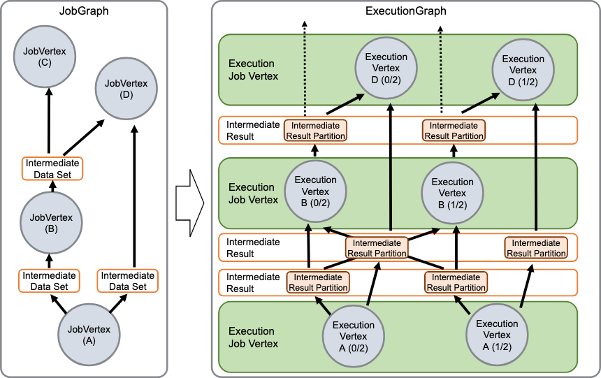

# Flink 源码分析 - Execution Graph
## 概览
Stream Graph 和 Job Graph 都是在 client 端编译生成的，用于描述用户定义的数据流逻辑。而集群（JobManager）需要一个具体可以执行的调度拓扑图，这个就是 execution graph。简单说 execution graph 是 JobGraph 的并行化版本， 是 flink 中最核心的调度数据，主要用于描述分布式执行任务 execution 之间的数据流

一个 execution graph 包含每个并发的任务（task），每个中间计算结果（intermediate）以及他们的关系。Execution graph 主要由以下几个核心部分组成：
 - ExecutionJobVertex： 一个 ExecutionJobVertex 和 JobGraph 中的某个顶点（vertex）对应，在 execution graph 中一般也是由 JobVertexID 来唯一标示的。 一个 ExecutionJobVertex 一般代表的是某个处理算子比如 "map"、"join"的具体执行。
 - ExecutionVertex：代表某个具体的并行执行的子任务（sub task）。所以每个 ExecutionJobVertex 都会持有和 parallelism 设置个数一样的 ExecutionVertex。同样的，一个 ExecutionVertex 由一个 ExecutionJobVertex 和 subtask id 确定。
 - Execution 代表 ExecutionVertex 一次具体的执行记录。因为任务执行可能会失败，所以一个 ExecutionVertex 可能会产生多次 Execution。每个 Execution 会有一个对应的 ExecutionAttemptID 标记，JobManager 和 TaskManager 之间通过 ExecutionAttemptID 来更新执行任务的状态。

下面这幅图描述了 JobGraph 和 Execution Graph 之间的对应关系。可以看到 JobVertexA 的并行度为 2，所以对应的 ExecutionJobVertex 包含两个 ExecutionVertex 。除了 vertices, ExecutionGraph 还包含了 IntermediateResult 和 IntermediateResultPartition 。IntermediateResult 对应 JobGraph 中的 IntermediateDataSet, 代表的是整个顶点（ExecutionJobVertex）的数据输出。 IntermediateResultPartition 对应的是对应分区的数据输出，一个 IntermediateResult 会持有多个 IntermediateResultPartition。比如下面这个例子：并行度为 2 的 JobVertexD 数据来自 JobVertexB 和 JobVertexA，所以单个 ExecutionVertex D(0) 和 ExecutionVertex A(0) 通过一个 IntermediateResultPartition 连接在了一起。



## 数据结构
ExecutionGraph 根据 JobVertex 生成对应的任务容器即 tasks， 用 ConcurrentHashMap 组织。同时会持有所有 ExecutionJobVertex 产出的中间结果：intermediateResults，用 ConcurrentHashMap 组织。上面提到过每个 ExecutionJobVertex 会有具体的执行实例：Execution，用 ConcurrentHashMap 组织。以及整个 ExecutionGraph 中所有任务都共享的任务失败恢复策略 failoverStrategy。恢复策略分本地恢复策略和全局恢复策略，全局恢复策略会终止所有 vertices，并根据之前的 checkpoint 重启整个数据流。全局恢复策略消耗比较大，只会在本地恢复策略不起作用的时候才会采用。本地恢复策略会尽可能小范围的重启 vertices，将损耗降到最低。
```
public class ExecutionGraph  {
	/** 所有的 job vertices */
	private final ConcurrentHashMap<JobVertexID, ExecutionJobVertex> tasks;

	/** 每个 IntermediateResult 是一个 ExecutionJobVertex 计算输出数据集合 */
	private final ConcurrentHashMap<IntermediateDataSetID, IntermediateResult> intermediateResults;

	/** 当前正在执行的任务尝试 */
	private final ConcurrentHashMap<ExecutionAttemptID, Execution> currentExecutions;

	/** 任务失败恢复策略 一个 ExecutionGraph 中所有 task 都是一样的 */
	private final FailoverStrategy failoverStrategy;
}
```

ExecutionJobVertex 是 ExecutionGraph 翻译 JobVertex 得到的并行化版本。每个 ExecutionJobVertex 会根据设置的并行度生成任务集合 taskVertices。
```
public class ExecutionJobVertex {

    /** 所在的 ExecutionGraph 引用 */
	private final ExecutionGraph graph;

	/** 对应的 JobVertex 引用 */
	private final JobVertex jobVertex;

	/** ExecutionJobVertex 包含的具体并行任务 */	
	private final ExecutionVertex[] taskVertices;

	/** ExecutionJobVertex 包含的并行任务产出的数据集合 */	
	private final IntermediateResult[] producedDataSets;

	/** ExecutionJobVertex 包含的并行任务所需要的输入数据集合 */	
	private final List<IntermediateResult> inputs;

    /** ExecutionJobVertex 并行度 */	
	private final int parallelism;
    
	/** ExecutionJobVertex 属于的资源 slot group */	
	private final SlotSharingGroup slotSharingGroup;
 	
	/** ExecutionJobVertex 属于的 taskManger group */	
	private final CoLocationGroup coLocationGroup;
}
```

ExecutionVertex 是具体的并发计算任务，一个任务可能只执行一次，也可能因为失败而执行多次。一个 ExecutionVertex 会有多个 IntermediateResultPartition，一个 IntermediateResultPartition 代表一次产出数据的引用。
```
public class ExecutionVertex implements AccessExecutionVertex, Archiveable<ArchivedExecutionVertex> {

    /** ExecutionJobVertex 引用 */
	private final ExecutionJobVertex jobVertex;

	/** 任务计算的产出数据集合  */
	private final Map<IntermediateResultPartitionID, IntermediateResultPartition> resultPartitions;

	/** 任务入边集合 */
	private final ExecutionEdge[][] inputEdges;

}

public class ExecutionEdge {
	/** 数据来源 */
	private final IntermediateResultPartition source;
	/** 连接的目标 ExecutionVertex */	
	private final ExecutionVertex target;
}

public class IntermediateResult {
	/** 数据生产者 */
	private final ExecutionJobVertex producer;
	/** 数据分区集合 每个分区代表一次数据集引用 */
	private final IntermediateResultPartition[] partitions;

}

public class IntermediateResultPartition {
    /** 数据生产者 */
	private final ExecutionVertex producer;
    /** 分区 id */
	private final IntermediateResultPartitionID partitionId;
	 /** 数据消费者 */
	private List<List<ExecutionEdge>> consumers;
}
```
## 生成逻辑
主要逻辑子啊 ExecutionGraphBuilder.buildGraph 中：
```
public static ExecutionGraph buildGraph (...) {


	// 获取恢复策略
	final FailoverStrategy.Factory failoverStrategy =
				FailoverStrategyLoader.loadFailoverStrategy(jobManagerConfig, log);
    
	// 获取 JobVertex 的拓扑排序 相同的数据流生成的拓扑排序应该是一致的
	List<JobVertex> sortedTopology = jobGraph.getVerticesSortedTopologicallyFromSources();
	if (log.isDebugEnabled()) {
			log.debug("Adding {} vertices from job graph {} ({}).", sortedTopology.size(), jobName, jobId);
	}

	// executionGraph 关联 JobVertex 的拓扑排序 生成 ExecutionJobVertex 
	executionGraph.attachJobGraph(sortedTopology);

	// 配置 state checkpointing
				
}
````

由 jobGraph 生成 ExecutionJobVertex 的逻辑在 executionGraph.attachJobGraph 中：

```
public void attachJobGraph(List<JobVertex> topologiallySorted) throws JobException {
	// 省略 ....

   for (JobVertex jobVertex : topologiallySorted) {
	   // 省略 ....

	   // 生成 ExecutionJobVertex
       ExecutionJobVertex ejv = new ExecutionJobVertex(
				this,
				jobVertex,
				1,
				rpcTimeout,
				globalModVersion,
				createTimestamp);
		// 关联 ExecutionJobVertex 和 intermediateResults
		ejv.connectToPredecessors(this.intermediateResults);
		// 省略 ....
		newExecJobVertices.add(ejv);
   }
}
```
生成 ExecutionVertex 的逻辑主要在 ExecutionJobVertex 构造函数中：
```
public ExecutionJobVertex(...)  {

	// 省略 ....

	// 获取并行度
	int vertexParallelism = jobVertex.getParallelism();
	int numTaskVertices = vertexParallelism > 0 ? vertexParallelism : defaultParallelism;
	this.taskVertices = new ExecutionVertex[numTaskVertices];

	// 省略 ....
	
	// create all task vertices
	for (int i = 0; i < numTaskVertices; i++) {
		// 根据并行度生成 ExecutionVertex
		ExecutionVertex vertex = new ExecutionVertex(
					this,
					i,
					producedDataSets,
					timeout,
					initialGlobalModVersion,
					createTimestamp,
					maxPriorAttemptsHistoryLength);

		this.taskVertices[i] = vertex;
	}	

	// 省略 ....
}
```
生成 Execution 的逻辑在 ExecutionVertex 构造函数中：
```
public ExecutionVertex(...) {

	// 构造 Execution 实例
	this.currentExecution = new Execution(
			getExecutionGraph().getFutureExecutor(),
			this,
			0,
			initialGlobalModVersion,
			createTimestamp,
			timeout);
	// 注册 Execution 到 ExecutionGraph 中
	getExecutionGraph().registerExecution(currentExecution);

} 
```

## 小结
本文总结了 Execution Graph 的数据结构以及 Execution Graph 是如何从 Job Graph 翻译过来的。JobManager 根据 JobGraph 生成ExecutionGraph。ExecutionGraph是JobGraph的并行化版本，ExecutionJobVertex 和JobGraph中的JobVertex一一对应。
ExecutionVertex 表示 ExecutionJobVertex 的其中一个并发子任务。IntermediateResult 和JobGraph中的IntermediateDataSet一一对应。一个IntermediateResult包含多个IntermediateResultPartition，其个数等于该operator的并发度。
IntermediateResultPartition 表示ExecutionVertex的一个输出分区，producer是ExecutionVertex，consumer是若干个ExecutionEdge。Execution：是执行一个 ExecutionVertex 的一次尝试。当发生故障或者数据需要重算的情况下 ExecutionVertex 可能会有多个 ExecutionAttemptID。一个 Execution 通过 ExecutionAttemptID 来唯一标识。JM和TM之间关于 task 的部署和 task status 的更新都是通过 ExecutionAttemptID 来确定消息接受者。