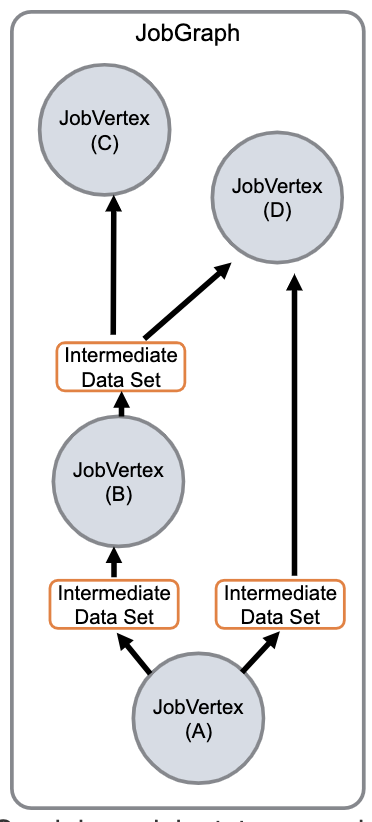

# Flink 源码分析 - Job Graph

SteamGraph 主要描述了数据流的逻辑视图，而 JobGraph 用于表示一个 flink 程序经过优化后的数据流视图，主要被 JobManager 使用。这里的优化主要是指 chain 操作，即把可以多个 StreamNode 合并成一个 JobVertex。

涉及到的主要数据结构:
JobGraph 是供 JobManager 使用的优化后的数据流视图，主要由顶点 JobVertex 组成。
```
public class JobGraph implements Serializable {
	// JobVertex 集合 key 为 JobVertex ID 由 StreamNode hash 而来
	private final Map<JobVertexID, JobVertex> taskVertices = new LinkedHashMap<JobVertexID, JobVertex>()
}
```
JobVertex 是由一个或多个 Operator 组合（chain） 在一起的计算单元。每个 JobVertex 有唯一标示的 JobVertexID、包含的 Operator 集合、产生的数据集合（IntermediateDataSet）、以及输入数据（连接到上游顶点的 JobEdge）。
```
public class JobVertex implements java.io.Serializable {
	/** vertex 的 ID */
	private final JobVertexID id;
	/** vertex 包含的所有操作子 ID */
	private final ArrayList<OperatorID> operatorIDs = new ArrayList<>();
	/** 产生的数据集合 被下游的 vertex 使用 */
	private final ArrayList<IntermediateDataSet> results = new ArrayList<IntermediateDataSet>();
	/** 输入的上游数据 可能有多份 每份用 JobEdge 表示  */
	private final ArrayList<JobEdge> inputs = new ArrayList<JobEdge>();
}
```
JobEdge 主要用于连接 JobGraph 中各个 JobVertex ，每条 JobEdge 都有一个数据源 source（ IntermediateDataSet 类型），以及目标顶点 target（JobVertex 类型）。
```
public class JobEdge implements java.io.Serializable {
	/** 连接的目标 JobVertex  */
	private final JobVertex target;
	/** 这条 JobEdge 的源数据集*/
	private IntermediateDataSet source;
	/** 源数据集的 ID */
	private IntermediateDataSetID sourceId;
}
```
IntermediateDataSet 并不是实际的数据容器，而是用于连接 JobVertex 和下游的 JobEdge 的元数据实例。 IntermediateDataSet 的 producer 即产生这份数据的 JobVertex，consumers 即所有会消费这份数据的 JobEdge，从上面 JobVertex 结构可以看到每个 JobVertex 可以有多个 JobEdge 作为输入源（inputs）。
```
public class IntermediateDataSet implements java.io.Serializable {
	private final JobVertex producer;			// 生产这份数据的顶点
	private final List<JobEdge> consumers = new ArrayList<JobEdge>(); // 消费这份数据的 JobEdge 列表 
}
```
下面这幅图描述了 JobGraph、JobVertex、JobEdge、IntermediateDataSet 之间的关系。



由 StreamGraph 生成 JobGraph 的逻辑主要在 StreamingJobGraphGenerator 中。
```
private JobGraph createJobGraph() {
		// 设置调度模式为 EAGER 即所有 task 立马启动
		jobGraph.setScheduleMode(ScheduleMode.EAGER);
        // BFS 算法遍历所有节点生成 hash 值 如果多次提交的任务拓扑不变则生成
        // 的 hash 值不变
		Map<Integer, byte[]> hashes = defaultStreamGraphHasher.traverseStreamGraphAndGenerateHashes(streamGraph);
        
        // 省略 ...
        
        // 将符合条件的 Operator chain 在一起
		setChaining(hashes, legacyHashes, chainedOperatorHashes);
        // 将入边集合写入每个 vertex 的 stream config 中
		setPhysicalEdges();
        // 设置每个 vertex 的 SlotSharingGroup 以及 CoLocationGroup
		setSlotSharingAndCoLocation();
        // 配置 checkpoint
		configureCheckpointing();
        // 添加用户的自定义文件
		JobGraphGenerator.addUserArtifactEntries(streamGraph.getEnvironment().getCachedFiles(), jobGraph);
        
        // 省略 ...
	
		return jobGraph;
	}
```
主流程非常清晰，首先遍历所有的 StreamNode 生成 hash 用于标记 vertex，对于同样拓扑重复提交生成的 hash 是一致的。根据生成的 hash 数组遍历 StreamNode 每条 OutEdge，对于能够合并的操作进行 chain。将 InputEdges 写入 StreamConfig，设置每个 vertex 的 SlotSharingGroup 以及 CoLocationGroup， 配置 checkpoint，添加用户的自定义文件等操作后即生成 jobGraph。

这里最关键的是如何进行 chain 操作。在 createChain 中，下面是主流程分析：
```
private List<StreamEdge> createChain(
			Integer startNodeId,
			Integer currentNodeId,
			Map<Integer, byte[]> hashes,
			List<Map<Integer, byte[]>> legacyHashes,
			int chainIndex,
			Map<Integer, List<Tuple2<byte[], byte[]>>> chainedOperatorHashes) {

		if (!builtVertices.contains(startNodeId)) {

			List<StreamEdge> transitiveOutEdges = new ArrayList<StreamEdge>();

			List<StreamEdge> chainableOutputs = new ArrayList<StreamEdge>();
			List<StreamEdge> nonChainableOutputs = new ArrayList<StreamEdge>();

			for (StreamEdge outEdge : streamGraph.getStreamNode(currentNodeId).getOutEdges()) {
                // 这里判断一个出边的上游节点和下游节点能否chain在一起
				if (isChainable(outEdge, streamGraph)) {
					chainableOutputs.add(outEdge);
				} else {
					nonChainableOutputs.add(outEdge);
				}
			}

			for (StreamEdge chainable : chainableOutputs) {
                // 对于能够 chain 在一起的节点先不做 add 操作
                // 递归调用（原节点，目标节点）相当于跳过了当前节点 还是在同一个 chain 内
				transitiveOutEdges.addAll(
						createChain(startNodeId, chainable.getTargetId(), hashes, legacyHashes, chainIndex + 1, chainedOperatorHashes));
			}

			for (StreamEdge nonChainable : nonChainableOutputs) {
                 // 不能被 chain 边先直接进行 add 操作
				transitiveOutEdges.add(nonChainable);
                // 递归调用（目标节点，目标节点）即创建新的 chain
				createChain(nonChainable.getTargetId(), nonChainable.getTargetId(), hashes, legacyHashes, 0, chainedOperatorHashes);
			}

			List<Tuple2<byte[], byte[]>> operatorHashes =
				chainedOperatorHashes.computeIfAbsent(startNodeId, k -> new ArrayList<>());

			byte[] primaryHashBytes = hashes.get(currentNodeId);
            // 省略 ...
           
            // 判断是否是在同一个 chain 内
			StreamConfig config = currentNodeId.equals(startNodeId)
					? createJobVertex(startNodeId, hashes, legacyHashes, chainedOperatorHashes) // 如果不是 则创建一个 JobVertex 返回对应的 config
					: new StreamConfig(new Configuration()); // 否则就创建一个空的 config

			setVertexConfig(currentNodeId, config, chainableOutputs, nonChainableOutputs);
            // 如果是新的 chain
			if (currentNodeId.equals(startNodeId)) {

				config.setChainStart(); // 标记 chain 的开始
				config.setChainIndex(0);
				config.setOperatorName(streamGraph.getStreamNode(currentNodeId).getOperatorName());
				config.setOutEdgesInOrder(transitiveOutEdges);
				config.setOutEdges(streamGraph.getStreamNode(currentNodeId).getOutEdges());

				for (StreamEdge edge : transitiveOutEdges) {
                    // 创建 JobEdge 
					connect(startNodeId, edge);
				}

				config.setTransitiveChainedTaskConfigs(chainedConfigs.get(startNodeId));

			} else {
                // 还在同一个 chain 内
                // 配置 chainedConfigs 记录同一个 chain 内的 stream config
				chainedConfigs.computeIfAbsent(startNodeId, k -> new HashMap<Integer, StreamConfig>());

				config.setChainIndex(chainIndex);
				StreamNode node = streamGraph.getStreamNode(currentNodeId);
				config.setOperatorName(node.getOperatorName());
				chainedConfigs.get(startNodeId).put(currentNodeId, config);
			}

			config.setOperatorID(new OperatorID(primaryHashBytes));

			if (chainableOutputs.isEmpty()) {
				config.setChainEnd();
			}
			return transitiveOutEdges;

		} else {
			return new ArrayList<>();
		}
	}

```
小结一下，上述过程实际上是 dfs StreamGraph 中每个 SteamNode，判断 node 每条 OutEdge 的上下游节点是否能够进行 chain 操作。如果是可以 chain 的，则将 OutEdge 下游节点作为当前节点进行递归调用，直到找到不能 chain 的节点。对于不能 chain 的节点则创建一个新的 JobVertex 和 JobEdge 。