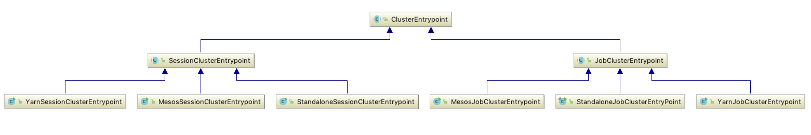
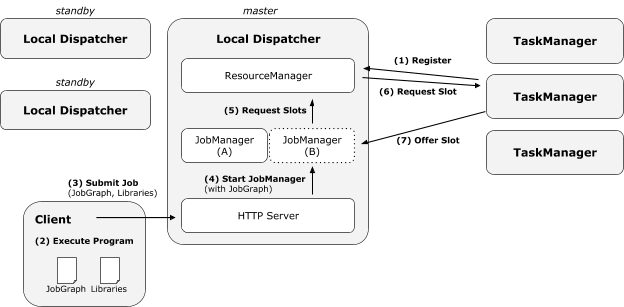
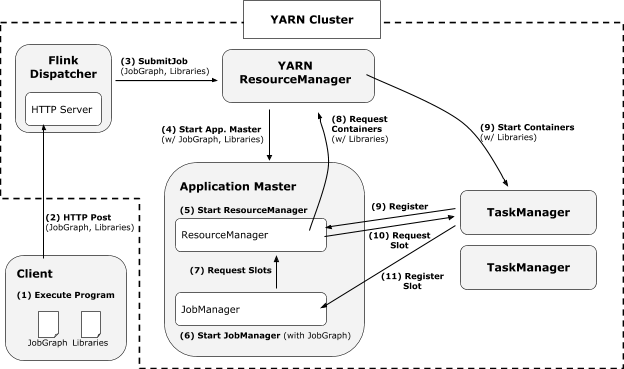

# Flink 源码分析 - 集群启动过程

Flink 集群的入口在 ClusterEntrypoint 抽象类中类，根据不同的集群模式又分 SessionClusterEntrypoint（session 模式） 和 JobClusterEntrypoint（job 模式）具体实现。同时每种模式又根据不同的 Deploy 模式分为 Yarn、Mesos、Standlon 具体实现。继承关系如下：


Flink 支持两种不同的模式，即 Per-job 模式与 Session 模式。Per-job 模式下整个 Flink 集群只执行单个作业，即每个作业会独享 Dispatcher 和 ResourceManager 组件。此外，Per-job 模式下 AppMaster 和 TaskExecutor 都是按需申请的。因此，Per-job 模式更适合运行执行时间较长的大作业，这些作业对稳定性要求较高，并且对申请资源的时间不敏感。与之对应，在 Session 模式下，Flink 预先启动 AppMaster 以及一组 TaskExecutor，然后在整个集群的生命周期中会执行多个作业。可以看出，Session 模式更适合规模小，执行时间短的作业。

## Standalone 部署模式
独立部署模式不依赖第三方资源管理框架，dispatcher 进程负责维护一个 resourceMananger 用于维护整个集群的资源，以及常驻的 http server 用于接受 client 端请求。对于每次 client 端的提交，dispatcher 会生成一个 jobManagerRunner 用于孵化 jobManager 实例。所有组件都提供高可用实现，封装在 HighAvailabilityServices 中，具体通过 LeaderElectionService 接口实现选举。LeaderElectionService 负责组件层级的节点的选举过程，以ZooKeeperLeaderElectionService 举例，基于 ZK 的 LeaderElectionService 实现，当监听到 zk 存储的路径发生状态变化，会触发 LeaderLatch 的 handleStateChange 方法。




在 Session 模式下，Flink 预先启动 AppMaster 以及一组 TaskExecutor，运行期间根据客户端期间的 JobGraph 生成对应的执行任务，在运行期间所有任务的资源都是共享的。
从脚本 bin/flink-daemon.sh 来看：
```
(standalonesession)
    CLASS_TO_RUN=org.apache.flink.runtime.entrypoint.StandaloneSessionClusterEntrypoint
;;
(standalonejob)
    CLASS_TO_RUN=org.apache.flink.container.entrypoint.StandaloneJobClusterEntryPoint
```
入口类有两个：
- org.apache.flink.container.entrypoint.StandaloneJobClusterEntryPoint
- org.apache.flink.runtime.entrypoint.StandaloneSessionClusterEntrypoint

两者的差异在于 DispatcherResourceManagerComponentFactory 生成的组件即 dispatcher、resource manager、reset endpoint 不同。 StandaloneSessionClusterEntrypoint:
```
	@Override
	protected DispatcherResourceManagerComponentFactory<?> createDispatcherResourceManagerComponentFactory(Configuration configuration) {
		return new SessionDispatcherResourceManagerComponentFactory(StandaloneResourceManagerFactory.INSTANCE);
	}

```
对应生成的组件：
- SessionDispatcherFactory.INSTANCE 生成 StandaloneDispatcher
- StandaloneResourceManagerFactory.INSTANCE 生成 StandaloneResourceManager
- SessionRestEndpointFactory.INSTANCE 生成 DispatcherRestEndpoint

StandaloneDispatcher 为每个提交的 JobGraph 多会生成一个对应的 JobMaster。

Per-job 模式下 AppMaster 和 TaskExecutor 都是按需申请的。在启动的时候会先使用 jobGraphRetriever 获取提交任务的 JobGraph，并传递给  MiniDispatcher。

StandaloneJobClusterEntryPoint:
```

	@Override
	protected DispatcherResourceManagerComponentFactory<?> createDispatcherResourceManagerComponentFactory(Configuration configuration) {
		return new JobDispatcherResourceManagerComponentFactory(
			StandaloneResourceManagerFactory.INSTANCE,
			new ClassPathJobGraphRetriever(jobId, savepointRestoreSettings, programArguments, jobClassName));
	}

```
对应生成的组件：
- JobDispatcherFactory 生成 MiniDispatcher 
- StandaloneResourceManagerFactory.INSTANCE 生成 StandaloneResourceManager
- JobRestEndpointFactory.INSTANCE 生成 MiniDispatcherRestEndpoint

和 Session 不同，Per-job 在启动的时候就确定了明确的任务，会根据任务按需生成  AppMaster 和 TaskExecutor。
```
public class JobDispatcherFactory implements DispatcherFactory<MiniDispatcher> {

	private final JobGraphRetriever jobGraphRetriever; // 获取 JobGraph

	public JobDispatcherFactory(JobGraphRetriever jobGraphRetriever) {
		this.jobGraphRetriever = jobGraphRetriever;
	}

	@Override
	public MiniDispatcher createDispatcher(...) throws Exception {
		// 根据配置解析生成 jobGraph
		final JobGraph jobGraph = jobGraphRetriever.retrieveJobGraph(configuration);
		// 执行模式 分两种：NORMAL 模式会等待结果 DETACHED 当任务完成后直接停止
		final String executionModeValue = configuration.getString(EXECUTION_MODE);
		final ClusterEntrypoint.ExecutionMode executionMode = ClusterEntrypoint.ExecutionMode.valueOf(executionModeValue);
		return new MiniDispatcher(
			...
			historyServerArchivist,
			jobGraph,
			executionMode);
	}
}
```
不同部署模式的集群启动逻辑是抽象统一的，具体代码在 ClusterEntrypoint 的 runCluster 方法中：
```
private void runCluster(Configuration configuration) throws Exception {
		synchronized (lock) {
			// 初始化 rpc 服务、ha 服务、metric 服务
			initializeServices(configuration);

			final DispatcherResourceManagerComponentFactory<?> dispatcherResourceManagerComponentFactory = createDispatcherResourceManagerComponentFactory(configuration);
            // 初始化 dispatcher、resourceManager 服务、rpc 监听服务
			clusterComponent = dispatcherResourceManagerComponentFactory.create(
				configuration,
				commonRpcService,
				haServices,
				blobServer,
				heartbeatServices,
				metricRegistry,
				archivedExecutionGraphStore,
				new RpcMetricQueryServiceRetriever(metricRegistry.getMetricQueryServiceRpcService()),
				this);
		}
	}
```
 在创建 clusterComponent 的过程中 restEndpointFactory 会初始化基于 netty 的 REST 服务。 具体任务处理客户端任务提交的代码根据模式生成的 RestEndpoint 决定，session 模式采用 DispatcherRestEndpoint，job 模式采用的 MiniDispatcherRestEndpoint。 
 
 对于 session 模式 DispatcherRestEndpoint 具体处理逻辑在 JobSubmitHandler 的 handleRequest 中：
```
// 处理客户端提交的任务
@Override
protected CompletableFuture<JobSubmitResponseBody> handleRequest(@Nonnull HandlerRequest<JobSubmitRequestBody, EmptyMessageParameters> request, @Nonnull DispatcherGateway gateway) throws RestHandlerException {
	    // 获取提交的 jar
		final Collection<File> uploadedFiles = request.getUploadedFiles();
		final Map<String, Path> nameToFile = uploadedFiles.stream().collect(Collectors.toMap(
			File::getName,
			Path::fromLocalFile
		));

		final JobSubmitRequestBody requestBody = request.getRequestBody();
        // 获取 JobGraph
		CompletableFuture<JobGraph> jobGraphFuture = loadJobGraph(requestBody, nameToFile);

		// 获取 jar 文件路径
		Collection<Path> jarFiles = getJarFilesToUpload(requestBody.jarFileNames, nameToFile);

		Collection<Tuple2<String, Path>> artifacts = getArtifactFilesToUpload(requestBody.artifactFileNames, nameToFile);
        // 上传 jar 文件到 blob service 并关联到 JobGraph 中
		CompletableFuture<JobGraph> finalizedJobGraphFuture = uploadJobGraphFiles(gateway, jobGraphFuture, jarFiles, artifacts, configuration);

		// 提交 JobGraph 给 dispatcher
		CompletableFuture<Acknowledge> jobSubmissionFuture = finalizedJobGraphFuture.thenCompose(jobGraph -> gateway.submitJob(jobGraph, timeout));

		return jobSubmissionFuture.thenCombine(jobGraphFuture,
			(ack, jobGraph) -> new JobSubmitResponseBody("/jobs/" + jobGraph.getJobID()));
}
```

## YARn 部署模式
在运行高可用性 YARN 集群时，我们不会运行多个 JobManager (ApplicationMaster) 实例，而只运行一个，该JobManager实例失败时，YARN会将其重新启动。Yarn的具体行为取决于您使用的 YARN 版本。



```
入口脚本
bin/yarn-session.sh:$JAVA_RUN $JVM_ARGS -classpath "$CC_CLASSPATH" $log_setting org.apache.flink.yarn.cli.FlinkYarnSessionCli -j "$FLINK_LIB_DIR"/flink-dist*.jar "$@"

FlinkYarnSessionCli.main -> run -> createClusterDescriptor 
	-> AbstractYarnClusterDescriptor.deploySessionCluster -> deployInternal （YarnSessionClusterEntrypoint 作为部署类）
	    -> startAppMaster yarn 集群启动 Application Master 
		-> appContext.setMaxAppAttempts（设置最大重试次数） -> setupApplicationMasterContainer 
		-> appContext.setAMContainerSpec(amContainer) -> yarnClient.submitApplication(appContext)
			-> YarnClusterDescriptor.createYarnClusterClient -> new RestClusterClient -> new RestClient（返回客户端）
```

YarnSessionClusterEntrypoint
```
YarnSessionClusterEntrypoint.main -> runClusterEntrypoint -> startCluster -> runCluster
	-> dispatcherResourceManagerComponentFactory.create -> resourceManagerFactory.createResourceManager
	-> dispatcherFactory.createDispatcher -> createDispatcherResourceManagerComponent
```
 * Component which starts a {@link Dispatcher}, {@link ResourceManager} and {@link WebMonitorEndpoint}
 * in the same process.


```taskexecutor
org.apache.flink.runtime.taskexecutor.TaskManagerRunner

```