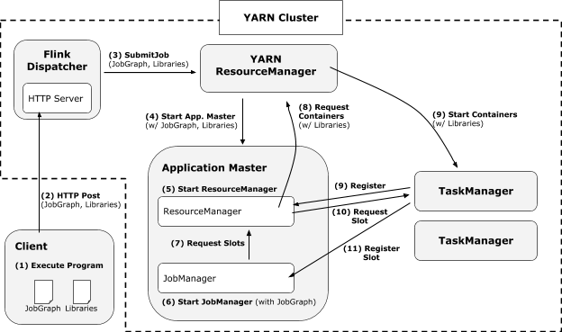

# Flink 源码分析 - Runtime 概览
## Runtime 概览
Flink 内部整体架构如下图。可以看到 flink 是一个分层的系统，每层负责具体的职责，同时对上层提供抽象的接口。从下往上看：
 - 最底层是 Deploy 层，主要负责屏蔽不同资源环境的差异化。可以看到分别有子模块 Local、Cluster、Cloud。 在这个模块的基础上 flink 做到了能够在不同环境中运行，同一个程序能部署到本地运行，也能部署到 Yarn 集群，或者到云环境中。 
 - 在 Deploy 层的基础上构建的是 Flink runtime， 是 flink 的核心模块。Runtime 接受 client 端编译生成的 JobGraph，通过集群中的资源信息生成对应的 task 并进行调度。
 - 在 runtime 的基础上是 API，主要是提供给客户端使用的编程接口。API 这层具体分面向流式处理的 DataStream API，面向批处理的 DataSet API。主要负责将用户的数据处理逻辑视图转化成 runtime 需要的 JobGraph，这里会包含每个具体任务的数据输入，处理逻辑，输出，以及任务之间的关联关系等重要信息。
 - 最顶层的是 Libraries 层，在 API 的基础上提供负责事件处理能力（CEP）、关系查询（Table & SQL）、机器学习（FlinkML）、图处理（Gelly）等功能。


Flink runtime 主要由两部分组成：
- JobManagers（JobMasters）负责协调分布式任务的执行，具体包括调度分布式任务、协调 checkpoints、协调任务失败恢复。一个集群中至少有一个 Job Manager，如果是一个真实的生产高可用集群则会有多个  Job Manager 实例，其中一个被选举为 leader 实例。
- TaskManagers（TaskExecutors）负责执行一个具体的数据流处理任务下的所属子任务。

除此之外需要注意 client 并不是 runtime 的一部分，client 主要负责准备好 JobManager 需要的数据流定义（JobGraph）。Client 将 JobGraph 发送至 JobManager 之后 client 端可以离线或者保持在线状态并接受任务的执行状态。这个设计也保证了 client 能使用不同语言实现。


## 任务提交流程
Flink 集群的入口在 ClusterEntrypoint 抽象类中类，根据不同的集群模式又分 SessionClusterEntrypoint（session 模式） 和 JobClusterEntrypoint（job 模式）具体实现。同时每种模式又根据不同的 Deploy 模式分为 Yarn、Mesos、Standlon 具体实现。继承关系如下：

集群启动代码在 ClusterEntrypoint 的 runCluster 方法中：
```
private void runCluster(Configuration configuration) throws Exception {
		synchronized (lock) {
			// 初始化 rpc 服务、ha 服务、metric 服务
			initializeServices(configuration);

			final DispatcherResourceManagerComponentFactory<?> dispatcherResourceManagerComponentFactory = createDispatcherResourceManagerComponentFactory(configuration);
            // 初始化 dispatcher、resourceManager 服务、rpc 监听服务
			clusterComponent = dispatcherResourceManagerComponentFactory.create(
				configuration,
				commonRpcService,
				haServices,
				blobServer,
				heartbeatServices,
				metricRegistry,
				archivedExecutionGraphStore,
				new RpcMetricQueryServiceRetriever(metricRegistry.getMetricQueryServiceRpcService()),
				this);
		}
	}
```
在创建 clusterComponent 的过程中 restEndpointFactory 会初始化基于 netty 的 REST 服务。具体任务处理客户端任务提交的代码在 JobSubmitHandler 的 handleRequest 中：
```
// 处理客户端提交的任务
@Override
protected CompletableFuture<JobSubmitResponseBody> handleRequest(@Nonnull HandlerRequest<JobSubmitRequestBody, EmptyMessageParameters> request, @Nonnull DispatcherGateway gateway) throws RestHandlerException {
	    // 获取提交的 jar
		final Collection<File> uploadedFiles = request.getUploadedFiles();
		final Map<String, Path> nameToFile = uploadedFiles.stream().collect(Collectors.toMap(
			File::getName,
			Path::fromLocalFile
		));

		final JobSubmitRequestBody requestBody = request.getRequestBody();
        // 获取 JobGraph
		CompletableFuture<JobGraph> jobGraphFuture = loadJobGraph(requestBody, nameToFile);

		// 获取 jar 文件路径
		Collection<Path> jarFiles = getJarFilesToUpload(requestBody.jarFileNames, nameToFile);

		Collection<Tuple2<String, Path>> artifacts = getArtifactFilesToUpload(requestBody.artifactFileNames, nameToFile);
        // 上传 jar 文件到 blob service 并关联到 JobGraph 中
		CompletableFuture<JobGraph> finalizedJobGraphFuture = uploadJobGraphFiles(gateway, jobGraphFuture, jarFiles, artifacts, configuration);

		// 提交 JobGraph 给 dispatcher
		CompletableFuture<Acknowledge> jobSubmissionFuture = finalizedJobGraphFuture.thenCompose(jobGraph -> gateway.submitJob(jobGraph, timeout));

		return jobSubmissionFuture.thenCombine(jobGraphFuture,
			(ack, jobGraph) -> new JobSubmitResponseBody("/jobs/" + jobGraph.getJobID()));
}
```
Dispatcher 在收到 JobGraph 后会生成一个 JobManagerRunner。JobManagerRunner 包含一个 LeaderElectionService，主要负责会 Job 层级的节点的选举过程。ZooKeeperLeaderElectionService 是基于 ZK 的 LeaderElectionService 实现，当监听到 zk 的节点发生状态变化，会触发 LeaderLatch 的 handleStateChange 方法。如果当前节点成功注册为 leader 节点，JobManagerRunner 会调用 startJobMaster 方法启动 JobMaster 实例。

JobMaster 启动后会异步启动整个 Job 




```
client - rpc -> JobSubmitHandler.handleRequest
                -> Dispatcher.submitJob -> internalSubmitJob -> persistAndRunJob -> runJob -> startJobManagerRunner
                    -> JobManagerRunner.start 

                        -> LeaderElectionService.start(this) -> LeaderLatch.start() -> LeaderLatch.internalStart -> LeaderLatch.listener.stateChanged -> LeaderLatch.handleStateChange -> LeaderLatch.setLeadership -> LeaderLatchListener.isLeader

                        -> JobManagerRunner.grantLeadership -> verifyJobSchedulingStatusAndStartJobManager -> startJobMaster

                            -> JobMaster.start -> startJobExecution -> resetAndScheduleExecutionGraph -> scheduleExecutionGraph 
                                -> ExecutionGraph.scheduleForExecution -> scheduleEager
                                    -> Execution.deploy 

                                        -> TaskManagerGateway.submitTask
                                            -> TaskExecutor.submitTask 
                                                -> Task.startTaskThread -> loadAndInstantiateInvokable
                                                    -> AbstractInvokable.invoke(StreamTask 包含 headOperator operatorChain  stateBackend)
```

分配资源：
```
ExecutionGraph.scheduleForExecution -> scheduleEager -> ExecutionJobVertex.allocateResourcesForAll -> Execution.allocateAndAssignSlotForExecution

Execution.deploy -> taskManagerGateway.submitTask 

TaskExecutor.submitTask 
 
TaskDeploymentDescriptor.loadBigData -> getSerializedJobInformation -> getSerializedTaskInformation

 Task.startTaskThread -> loadAndInstantiateInvokable -> AbstractInvokable.invoke(StreamTask 包含 headOperator 
 
 
 
 operatorChain  stateBackend)

```


```
/**
	 * The slot pool serves slot request issued by {@link ExecutionGraph}. It will attempt to acquire new slots
	 * from the ResourceManager when it cannot serve a slot request. If no ResourceManager is currently available,
	 * or it gets a decline from the ResourceManager, or a request times out, it fails the slot request. The slot pool also
	 * holds all the slots that were offered to it and accepted, and can thus provides registered free slots even if the
	 * ResourceManager is down. The slots will only be released when they are useless, e.g. when the job is fully running
	 * but we still have some free slots.
	 *
	 * <p>All the allocation or the slot offering will be identified by self generated AllocationID, we will use it to
	 * eliminate ambiguities.
	 *
	 * <p>TODO : Make pending requests location preference aware
	 * TODO : Make pass location preferences to ResourceManager when sending a slot request
	 */
	public class SlotPoolImpl implements SlotPool {

		protected final Logger log = LoggerFactory.getLogger(getClass());

		/** The interval (in milliseconds) in which the SlotPool writes its slot distribution on debug level. */
		private static final long STATUS_LOG_INTERVAL_MS = 60_000;

		private final JobID jobId;

		/** All registered TaskManagers, slots will be accepted and used only if the resource is registered. */
		private final HashSet<ResourceID> registeredTaskManagers;

		/** The book-keeping of all allocated slots. */
		private final AllocatedSlots allocatedSlots;

		/** The book-keeping of all available slots. */
		private final AvailableSlots availableSlots;

		/** All pending requests waiting for slots. */
		private final DualKeyMap<SlotRequestId, AllocationID, PendingRequest> pendingRequests;

		/** The requests that are waiting for the resource manager to be connected. */
		private final HashMap<SlotRequestId, PendingRequest> waitingForResourceManager;

		/** Timeout for external request calls (e.g. to the ResourceManager or the TaskExecutor). */
		private final Time rpcTimeout;

		/** Timeout for releasing idle slots. */
		private final Time idleSlotTimeout;

		private final Clock clock;

		/** the fencing token of the job manager. */
		private JobMasterId jobMasterId;

		/** The gateway to communicate with resource manager. */
		private ResourceManagerGateway resourceManagerGateway;

		private String jobManagerAddress;

		private ComponentMainThreadExecutor componentMainThreadExecutor;
    }
}
```


```
/**
 * An instance represents a {@code org.apache.flink.runtime.taskmanager.TaskManager}
 * registered at a JobManager and ready to receive work.
 */
public class Instance implements SlotOwner {

	private final static Logger LOG = LoggerFactory.getLogger(Instance.class);

	/** The lock on which to synchronize allocations and failure state changes */
	private final Object instanceLock = new Object();

	/** The instance gateway to communicate with the instance */
	private final TaskManagerGateway taskManagerGateway;

	/** The instance connection information for the data transfer. */
	private final TaskManagerLocation location;

	/** A description of the resources of the task manager */
	private final HardwareDescription resources;

	/** The ID identifying the taskManager. */
	private final InstanceID instanceId;

	/** The number of task slots available on the node */
	private final int numberOfSlots;

	/** A list of available slot positions */
	private final Queue<Integer> availableSlots;

	/** Allocated slots on this taskManager */
	private final Set<Slot> allocatedSlots = new HashSet<Slot>();

	/** A listener to be notified upon new slot availability */
	private SlotAvailabilityListener slotAvailabilityListener;

	/** Time when last heat beat has been received from the task manager running on this taskManager. */
	private volatile long lastReceivedHeartBeat = System.currentTimeMillis();

	/** Flag marking the instance as alive or as dead. */
	private volatile boolean isDead;

}
```