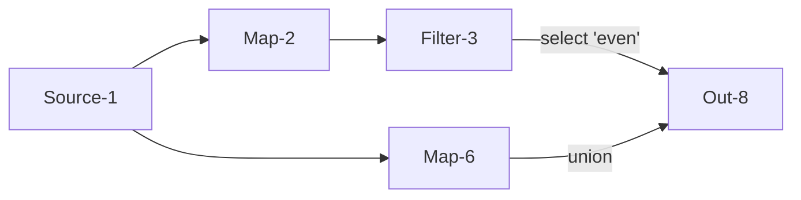

# Flink 源码分析 - Stream Graph
StreamGraph 由用户 api 转化而来，这步是在 client 端调用 StreamGraphGenerator.generate 完成的。而 StreamTransformation 是 StreamGraphGenerator 主要转化对象。
```java
	public static StreamGraph generate(StreamExecutionEnvironment env, List<StreamTransformation<?>> transformations) {
		return new StreamGraphGenerator(env).generateInternal(transformations);
	}
```

一个 StreamTransformation 表示如何生成一个 DataStream。每个 DataStream 都有一个 StreamTransformation 描述 DataStream 是如何生成的.DataStream 提供的算子函数，比如 map操作，实际上并没有立即进行计算任务，而是在背后先生成树形的 StreamTransformations 记录. 当最后执行整个计算程序的时候，StreamGraphGenerator 会将这个树形的记录翻译成 StreamGraph。

需要注意的是 StreamTransformation 和最后 StreamGraph 里的节点并不是一一对应的。一些操作只有逻辑上的概念并不会生成节点，比如 union、split/select、partitioning。举一个例子：
```
   Source              Source
      +                   +
      |                   |
      v                   v
  Rebalance          HashPartition
      +                   +
      |                   |
      |                   |
      +------>Union<------+
                +
                |
                v
              Split
                +
                |
                v
              Select
                +
                v
               Map
                +
                |
                v
              Sink
 
最后生成的 StreamGraph:

  Source              Source
    +                   +
    |                   |
    |                   |
    +------->Map<-------+
              +
              |
              v
             Sink
```
关于 partitioning, union, split/select 等操作信息会被放入 Source 和 Map 连接的边记录中。

每个 DataStream 都会和一个记录如何生成该记录的 StreamTransformation 对应，所以每种类型的 DataStream 都会有一种对应的 StreamTransformation。


如何构造 StreamGraph，比如 DataStream 中的 map 函数：
```java
	public <R> SingleOutputStreamOperator<R> map(MapFunction<T, R> mapper) {

		TypeInformation<R> outType = TypeExtractor.getMapReturnTypes(clean(mapper), getType(),
				Utils.getCallLocationName(), true);
        // 将用户定义的 mapper 函数包装成 StreamMap Operator
		return transform("Map", outType, new StreamMap<>(clean(mapper)));
	}

	public <R> SingleOutputStreamOperator<R> transform(String operatorName, TypeInformation<R> outTypeInfo, OneInputStreamOperator<T, R> operator) {

		// read the output type of the input Transform to coax out errors about MissingTypeInfo
		transformation.getOutputType();
        // 根据 input 和 operator 生成成新的 OneInputTransformation
		OneInputTransformation<T, R> resultTransform = new OneInputTransformation<>(
				this.transformation,
				operatorName,
				operator,
				outTypeInfo,
				environment.getParallelism());

		@SuppressWarnings({ "unchecked", "rawtypes" })
		SingleOutputStreamOperator<R> returnStream = new SingleOutputStreamOperator(environment, resultTransform);

        // 将新的 StreamTransformation 添加入 transformations 中
		getExecutionEnvironment().addOperator(resultTransform);

		return returnStream;
	}    

```
将一个 map 操作加入 data stream 可以分为以下几步：
1. 将用户定义的map操作包装成 StreamMap
2. 根据当前的transformation和StreamMap组合成新的OneInputTransformation，并添加到StreamExecutionEnvironment的 transformations列表中
3. 根据OneInputTransformation和env生成新的DataStream
   
当执行 StreamExecutionEnvironment.execute时，会遍历transformations列表中的所有transformation生成StreamGraph。最终生成逻辑在 StreamGraphGenerator 中：
```java
	private Collection<Integer> transform(StreamTransformation<?> transform) {
        // 省略 ...
		Collection<Integer> transformedIds;
        // 具体的转化操作
		if (transform instanceof OneInputTransformation<?, ?>) {
			transformedIds = transformOneInputTransform((OneInputTransformation<?, ?>) transform);
		} else if (transform instanceof TwoInputTransformation<?, ?, ?>) {
			transformedIds = transformTwoInputTransform((TwoInputTransformation<?, ?, ?>) transform);
		} else if (transform instanceof SourceTransformation<?>) {
			transformedIds = transformSource((SourceTransformation<?>) transform);
		} else if (transform instanceof SinkTransformation<?>) {
			transformedIds = transformSink((SinkTransformation<?>) transform);
		} else if (transform instanceof UnionTransformation<?>) {
			transformedIds = transformUnion((UnionTransformation<?>) transform);
		} else if (transform instanceof SplitTransformation<?>) {
			transformedIds = transformSplit((SplitTransformation<?>) transform);
		} else if (transform instanceof SelectTransformation<?>) {
			transformedIds = transformSelect((SelectTransformation<?>) transform);
		} else if (transform instanceof FeedbackTransformation<?>) {
			transformedIds = transformFeedback((FeedbackTransformation<?>) transform);
		} else if (transform instanceof CoFeedbackTransformation<?>) {
			transformedIds = transformCoFeedback((CoFeedbackTransformation<?>) transform);
		} else if (transform instanceof PartitionTransformation<?>) {
			transformedIds = transformPartition((PartitionTransformation<?>) transform);
		} else if (transform instanceof SideOutputTransformation<?>) {
			transformedIds = transformSideOutput((SideOutputTransformation<?>) transform);
		} else {
			throw new IllegalStateException("Unknown transformation: " + transform);
		}
        // 省略 ...

		return transformedIds;
	}
```
针对不同的transform有具体的转化操作，这里以 transformOneInputTransform 为例进行分析：
```java
private <IN, OUT> Collection<Integer> transformOneInputTransform(OneInputTransformation<IN, OUT> transform) {

        // 获取当前节点的前置节点 递归调用transform获得前置节点的 id
		Collection<Integer> inputIds = transform(transform.getInput());

		// the recursive call might have already transformed this
		if (alreadyTransformed.containsKey(transform)) {
			return alreadyTransformed.get(transform);
		}

		String slotSharingGroup = determineSlotSharingGroup(transform.getSlotSharingGroup(), inputIds);

        // 根据当前 transform 添加 StreamNode 到 streamGraph
		streamGraph.addOperator(transform.getId(),
				slotSharingGroup,
				transform.getCoLocationGroupKey(),
				transform.getOperator(),
				transform.getInputType(),
				transform.getOutputType(),
				transform.getName());

		if (transform.getStateKeySelector() != null) {
			TypeSerializer<?> keySerializer = transform.getStateKeyType().createSerializer(env.getConfig());
			streamGraph.setOneInputStateKey(transform.getId(), transform.getStateKeySelector(), keySerializer);
		}

		streamGraph.setParallelism(transform.getId(), transform.getParallelism());
		streamGraph.setMaxParallelism(transform.getId(), transform.getMaxParallelism());

        // 根据当前 transform 和前置节点的 input id 添加 StreamEdge 到 streamGraph
		for (Integer inputId: inputIds) {
			streamGraph.addEdge(inputId, transform.getId(), 0);
		}

		return Collections.singleton(transform.getId());
	}
```
总结一下关键的三步：
1. 获取当前节点的前置节点 递归调用transform获得前置节点的 id
2. 根据当前 transform 添加 StreamNode 到 streamGraph
3. 根据当前 transform 和前置节点的 input id 添加 StreamEdge 到 streamGraph

添加 StreamNode 到 streamGraph ：
``` java
	protected StreamNode addNode(Integer vertexID,
		String slotSharingGroup,
		@Nullable String coLocationGroup,
		Class<? extends AbstractInvokable> vertexClass,
		StreamOperator<?> operatorObject,
		String operatorName) {

		if (streamNodes.containsKey(vertexID)) {
			throw new RuntimeException("Duplicate vertexID " + vertexID);
		}

		StreamNode vertex = new StreamNode(environment,
			vertexID,
			slotSharingGroup,
			coLocationGroup,
			operatorObject,
			operatorName,
			new ArrayList<OutputSelector<?>>(),
			vertexClass);

		streamNodes.put(vertexID, vertex);

		return vertex;
	}
```
添加 StreamNode 还没有涉及到边的操作，只是简单的生成一个 StreamNode 实例并加入到 streamNodes 中。具体添加边的过程在 StreamGraph 的 addEdgeInternal 中：
``` java
private void addEdgeInternal(Integer upStreamVertexID,
			Integer downStreamVertexID,
			int typeNumber,
			StreamPartitioner<?> partitioner,
			List<String> outputNames,
			OutputTag outputTag) {

        // 处理虚拟节点 包括 SideOutput、Select、Partition

        // 针对 SideOutputTransformation 添加
		if (virtualSideOutputNodes.containsKey(upStreamVertexID)) {
			int virtualId = upStreamVertexID;
			upStreamVertexID = virtualSideOutputNodes.get(virtualId).f0;
			if (outputTag == null) {
				outputTag = virtualSideOutputNodes.get(virtualId).f1;
			}
			addEdgeInternal(upStreamVertexID, downStreamVertexID, typeNumber, partitioner, null, outputTag);
		} else if (virtualSelectNodes.containsKey(upStreamVertexID)) {
            // 针对 SelectTransformation、SplitTransformation 添加
			int virtualId = upStreamVertexID;
			upStreamVertexID = virtualSelectNodes.get(virtualId).f0;
			if (outputNames.isEmpty()) {
				// selections that happen downstream override earlier selections
				outputNames = virtualSelectNodes.get(virtualId).f1;
			}
			addEdgeInternal(upStreamVertexID, downStreamVertexID, typeNumber, partitioner, outputNames, outputTag);
		} else if (virtualPartitionNodes.containsKey(upStreamVertexID)) {
            // 针对 PartitionTransformation 添加
			int virtualId = upStreamVertexID;
			upStreamVertexID = virtualPartitionNodes.get(virtualId).f0;
			if (partitioner == null) {
				partitioner = virtualPartitionNodes.get(virtualId).f1;
			}
			addEdgeInternal(upStreamVertexID, downStreamVertexID, typeNumber, partitioner, outputNames, outputTag);
		} else {

            // 处理真正实节点 StreamNode 添加操作
			StreamNode upstreamNode = getStreamNode(upStreamVertexID);
			StreamNode downstreamNode = getStreamNode(downStreamVertexID);
            // 省略 ...
			StreamEdge edge = new StreamEdge(upstreamNode, downstreamNode, typeNumber, outputNames, partitioner, outputTag);

			getStreamNode(edge.getSourceId()).addOutEdge(edge);
			getStreamNode(edge.getTargetId()).addInEdge(edge);
		}
	}
```

边处理的过程包含几个步骤：
1. 处理虚拟节点 针对 SideOutputTransformation，从 virtualSideOutputNodes 中查找，如果找到替换 upStreamVertexID 递归调用 addEdgeInternal
2. 处理虚拟节点 针对 SelectTransformation、SplitTransformation 从 virtualSelectNodes 中查找。
3. 处理虚拟节点 针对 PartitionTransformation，从 virtualPartitionNodes 查找。
4. 构建边 Edge 记录，并添加到 Node 记录中。

生成的 StreamGraph 结构如下：
```java
class StreamGraph {
	
	// 生成的 StreamNode
	private Map<Integer, StreamNode> streamNodes;
	private Set<Integer> sources;
	private Set<Integer> sinks;

	// 转化虚拟节点使用
	private Map<Integer, Tuple2<Integer, List<String>>> virtualSelectNodes;
	private Map<Integer, Tuple2<Integer, OutputTag>> virtualSideOutputNodes;
	private Map<Integer, Tuple2<Integer, StreamPartitioner<?>>> virtualPartitionNodes;
}

class StreamNode{
	// 转化操作 比如 map 算子对应的 StreamMap
	private transient StreamOperator<?> operator;
	// split select 操作信息记录
	private List<OutputSelector<?>> outputSelectors;

	// 入边
	private List<StreamEdge> inEdges = new ArrayList<StreamEdge>();
	// 出边
	private List<StreamEdge> outEdges = new ArrayList<StreamEdge>();

}
```

总结一下:
当调用 DataStream 的算子比如 map、filter 等，会先生成一个 StreamTransformation，除了一些不需要实际节点的操作，会将 Transform 添加到 StreamExecutionEnvironment transformations 变量中，并返回新的 DataStream。当调用 StreamExecutionEnvironment.execute 方法会触发StreamGraphGenerator.generate操作，遍历 transformations 记录，根据不同的 transform 类型递归调用不同的转化方法，生成节点 Node 和边 Edge,最后返回 StreamGraph 实例。

## 一个实例
```scala
  def main(args: Array[String]): Unit = {
    val env: StreamExecutionEnvironment = StreamExecutionEnvironment.getExecutionEnvironment
    env.setStreamTimeCharacteristic(TimeCharacteristic.ProcessingTime)
    val data = Seq(new Integer(1),new Integer(1), new Integer(1), new Integer(3), new Integer(4))
    val dataStream = env.fromCollection(data)
    dataStream
      .map(_ + 1) // Map Transform
      .filter(e => e > 0) // Filter Transform
      .split(e => if(e%2==0) List("even") else List("ood"))
      .select("even")
      .union(dataStream.map(_.toInt)) // map(_.toInt) Map Transform
      .print() // Sink Transform
      .setParallelism(2)
    env.execute("Data Stream api...")
  }
```
上述对 data stream 的操作会在 StreamExecutionEnvironment 的 transformations 中生成 4 个 transform ：
```
0 = {OneInputTransformation@1295} "OneInputTransformation{id=2, name='Map', outputType=Integer, parallelism=8}"
1 = {OneInputTransformation@1372} "OneInputTransformation{id=3, name='Filter', outputType=Integer, parallelism=8}"
2 = {OneInputTransformation@1373} "OneInputTransformation{id=6, name='Map', outputType=Integer, parallelism=8}"
3 = {SinkTransformation@1374} "SinkTransformation{id=8, name='Print to Std. Out', outputType=GenericType<java.lang.Object>, parallelism=2}"
```
StreamGraphGenerator 开始遍历所有 transform：
1. 首先获取每个 transform 的 inputIds，这里第一个 Transform Map-2  的 inputIds 只有 Source-1。
2. streamGraph 将 Map-2 Transform 加入到 stream nodes 中。
3. 添加一条 Source - Map-2 的 Edge 记录
4. 处理 Filter-3 Transform，获取到 inputIds 为 Map-2.
5. 添加 Filter-3 到 stream nodes，并生成一条 Map-2 - Filter-3 的 Edge 记录。
6. 接下是 Map-6，但是这里获取到 inputIds 是 1 是一个 Source-1，因为第二个 map 操作是独立从 dataStream 开始的。
7. 再往下到了 Sink-8，获取到 inputIds 是两个：(6,9)。
8.  virtualSelectNodes 中编号为 9 的虚拟节点，存储的是 "9" -> "(3,[even])"，代表是来自 Filter-3 生成的 ”even“ 分支。这里会根据虚拟节点记录的上游信息生成一条 Filter-3 - Sink-8 的 Edge，和之前不同这里的 outputNames 参数是 "even"。
9. 编号 6 则是我们的第二个 Map Transform，会生成一条 Map-6 - Sink-8 的 Edge。

所以StreamGraph最终生成了 5 个 StreamNodes：
```
0 = {HashMap$Node@1432} "1" -> "Source: Collection Source-1"
1 = {HashMap$Node@1433} "2" -> "Map-2"
2 = {HashMap$Node@1434} "3" -> "Filter-3"
3 = {HashMap$Node@1435} "6" -> "Map-6"
4 = {HashMap$Node@1436} "8" -> "Sink: Print to Std. Out-8"
```
每个 stream node 拥有的 edge 以及 node 之间的关系，可以看到 split、select、union 只是逻辑上的操作节点并不生成 Node 实例：
