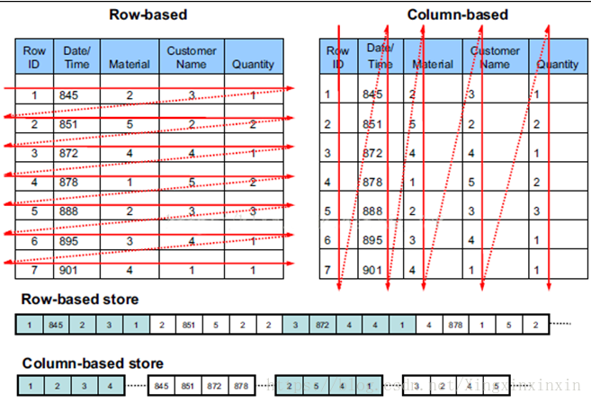

# Hbase 存储原理
## 对比
一个例子解释行存储和列存储的不同：

可以看到按“行存储”来存放数据同一行的数据是连续存储的，而按“列存储”来存放数据同一列的数据是连续存储。“列存储”中每一行的数据都被拆开存放，

写入比较：
- 行式存储一次性写入，列式存储需要把一行拆分成多列并行写入，写入效率行式存储较高。
- 数据修改也一样，行式存储查找都数据后能一次做完修改，而列式存储对于修改多列的操作需要多次进行。
- 行式存储写入数据的时候是一次性写入，能保证数据完整。列式存储的一行数据被拆开多列，写入可能会有某列失败，导致数据不完整。

读取比较：
- 行式存储每次读取会取出整行的数据，再剔除不需要的列，存在数据读取冗余。列存储按列存放数据，读取的时候只需要取需要的列即可，所以不存在冗余。
- 行存储一行数据每列的数据类型可能不同，在读取的时候需要进行解析会导致 cpu 消耗较高，尤其是对于大宽表。列存储把同一列的数据放在一起，类型都是一致的不存在这个问题。
- 列存储做数据压缩更有利，因为数据类型都是一致的对于一些数据类型可以做压缩。比如性别列只有两个值，“男”和“女”，可以对这一列建立位图索引：“男”对应的位图为100101，表示第1、4、6行值为“男”。
- 很多列式存储有列簇的概念，会把需要经常访问的列放在一起。如果需要读取的列属于同一个列簇可以一次性读出，避免了多列合并。列簇是行列混合的模式，可以同时满足 OLAP 和 OLTP 的需求。

## 小结
行式存储（mysql）写入效率高，适合 OLTP 场景，并且能保证数据完整性。

列式存储（Hbase）读取效率高，适合 OLAP 场景。尤其是在查询一个大宽表，需要读取几亿行但是只取其中几行的场景下，列式存储因为没有数据冗余所以效率很高。