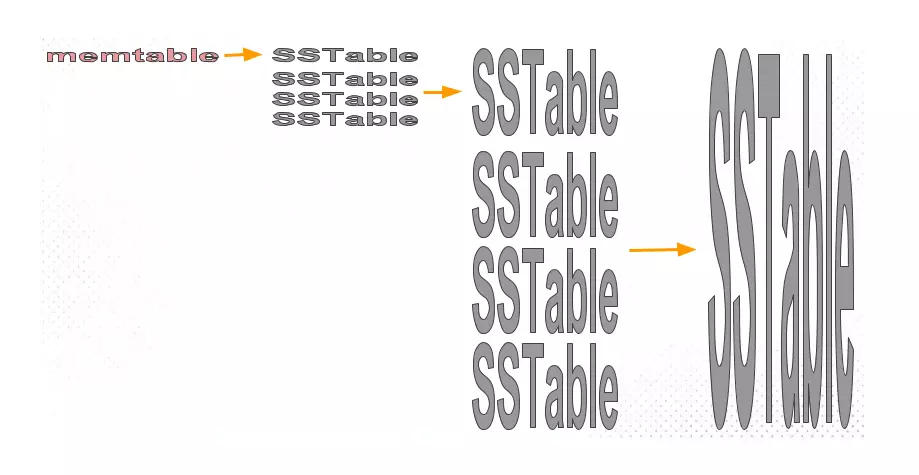
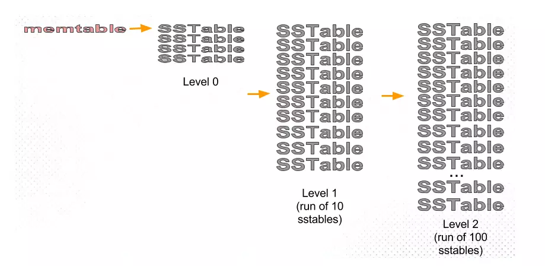

# LSM 存储
LSM一词全称为"Log-Structured Merged-Tree"。Google发表的Bigtable论文将其发扬光大。基于该思想实现的存储引擎：

- LevelDB。Google开源的单机版Bigtable实现，使用C++编写。
- RocksDB。来自Facebook，基于LevelDB改良而来，使用C++编写。
- HBase。最接近的BigTable开源实现，使用Java编写，是Hadoop的重要组成部分。
- Cassandra。来自Facebook的分布式数据库系统，同样借鉴了BigTable设计思想，使用Java编写。

和 B+ 树存储引擎的区别：
- B+ 树为每个key都创建一条索引，LSM 将文件分 block，索引建立在 block 上，是一种稀疏索引，所以消耗的内存很小。
- LSM 采用追加写的方案，数据分 block，后台定期将 block 合并只保留最新的值。能做到横向无限扩展。

## 合并策略
目前广泛应用的策略有两种：size-tiered策略和leveled策略。
- HBase采用的是size-tiered策略。
- LevelDB和RocksDB采用的是leveled策略。
- Cassandra两种策略都支持。

## size-tiered 策略
其基本原理是，每当某个尺寸的SSTable数量达到既定个数时，合并成一个大的SSTable，如下图所示：

缺点是合并时的空间放大效应，因为它需要将所有SSTable文件合并成一个文件，只有在合并完成后才能删除小的SSTable文件。

## leveled 策略
Leveled 核心思想就是将数据分成互不重叠的一系列固定大小（例如 2 MB）的SSTable文件，再将其分层（level）管理。对每个Level，我们都有一份清单文件记录着当前Level内每个SSTable文件存储的key的范围。因为如果我们可以每次只处理小部分SSTable文件，就可以大大改善空间放大问题了。

对照着上图再详细描述下LCS压缩策略：
先来看一下当Level >= 1时的合并策略。以Level 1为例，当Level 1的SSTable数量超过10个时，我们将多余的SSTable转存到Level-2。为了不破坏Level-2本身的互不重叠性，我们需要将Level-2内与这些待转存的SSTable有重叠的SSTable挑出来，然后将这些SSTable文件重新合并去重，形成新的一组SSTable文件。如果这组新的SSTable文件导致Level-2的总文件数量超过100个，再将多余的文件按照同样的规则转存到Level-3。

再来看看Level 0。Level 0的SSTable文件是直接从memtable转化来的：你没法保证这些SSTable互不重叠。所以，我们规定Level 0数量不能超过4个：当达到4个时，我们将这4个文件一起处理：合并去重，形成一组互不重叠的SSTable文件，再将其按照上一段描述的策略转存到Level 1。
