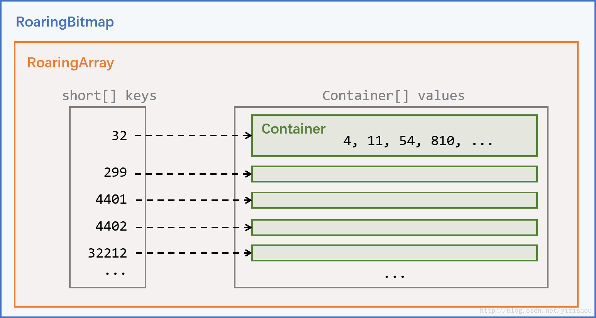
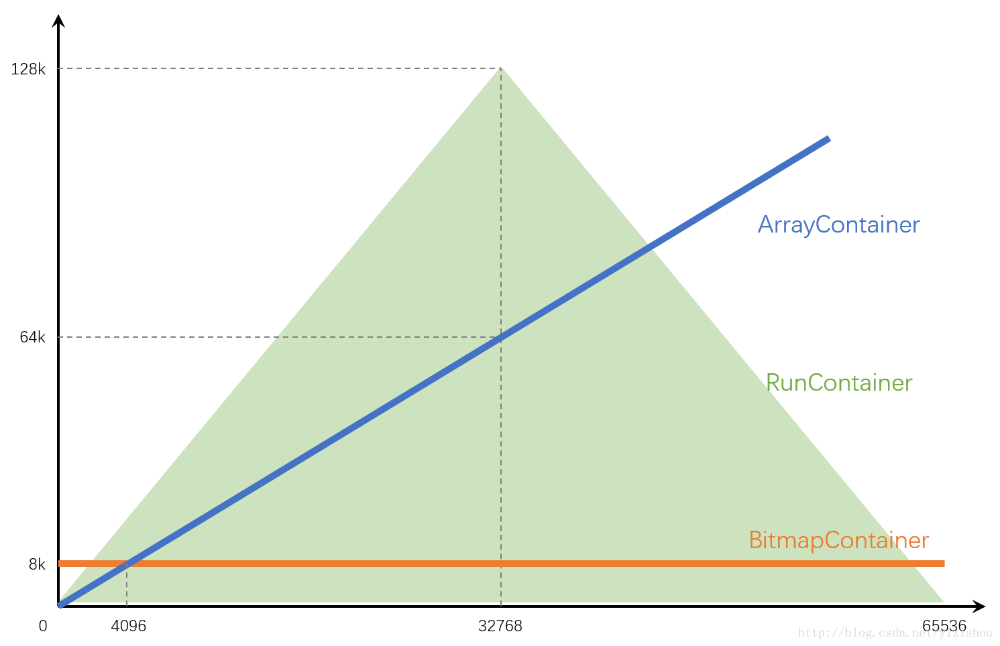

# RoaringBitmap



每个RoaringBitmap中都包含一个RoaringArray，名字叫highLowContainer。
highLowContainer存储了RoaringBitmap中的全部数据。
```
RoaringArray highLowContainer;
```
这个名字意味着，会将32位的整形（int）拆分成高16位和低16位两部分（两个short）来处理。
RoaringArray的数据结构很简单，核心为以下三个成员：
```
short[] keys;
Container[] values;
int size;
```

每个32位的整形，高16位会被作为key存储到short[] keys中，低16位则被看做value，存储到Container[] values中的某个Container中。keys和values通过下标一一对应。size则标示了当前包含的key-value pair的数量，即keys和values中有效数据的数量。

keys数组永远保持有序，方便二分查找。

## 三种Container
下面介绍到的是RoaringBitmap的核心，三种Container。

通过上面的介绍我们知道，每个32位整形的高16位已经作为key存储在RoaringArray中了，那么Container只需要处理低16位的数据。

### ArrayContainer
```
static final int DEFAULT_MAX_SIZE = 4096

short[] content;
```
结构很简单，只有一个short[] content，将16位value直接存储。

short[] content始终保持有序，方便使用二分查找，且不会存储重复数值。

因为这种Container存储数据没有任何压缩，因此只适合存储少量数据。

ArrayContainer占用的空间大小与存储的数据量为线性关系，每个short为2字节，因此存储了N个数据的ArrayContainer占用空间大致为2N字节。存储一个数据占用2字节，存储4096个数据占用8kb。

根据源码可以看出，常量DEFAULT_MAX_SIZE值为4096，当容量超过这个值的时候会将当前Container替换为BitmapContainer。

### BitmapContainer
```
final long[] bitmap;
```
这种Container使用long[]存储位图数据。我们知道，每个Container处理16位整形的数据，也就是0~65535，因此根据位图的原理，需要65536个比特来存储数据，每个比特位用1来表示有，0来表示无。每个long有64位，因此需要1024个long来提供65536个比特。

因此，每个BitmapContainer在构建时就会初始化长度为1024的long[]。这就意味着，不管一个BitmapContainer中只存储了1个数据还是存储了65536个数据，占用的空间都是同样的8kb。

### RunContainer
```
private short[] valueslength;

int nbrruns = 0;
```
RunContainer中的Run指的是行程长度压缩算法(Run Length Encoding)，对连续数据有比较好的压缩效果。

它的原理是，对于连续出现的数字，只记录初始数字和后续数量。即：

对于数列11，它会压缩为11,0；
对于数列11,12,13,14,15，它会压缩为11,4；
对于数列11,12,13,14,15,21,22，它会压缩为11,4,21,1；
源码中的short[] valueslength中存储的就是压缩后的数据。
这种压缩算法的性能和数据的连续性（紧凑性）关系极为密切，对于连续的100个short，它能从200字节压缩为4字节，但对于完全不连续的100个short，编码完之后反而会从200字节变为400字节。

如果要分析RunContainer的容量，我们可以做下面两种极端的假设：

最好情况，即只存在一个数据或只存在一串连续数字，那么只会存储2个short，占用4字节
最坏情况，0~65535的范围内填充所有的奇数位（或所有偶数位），需要存储65536个short，128kb

## Container性能总结
读取时间
只有BitmapContainer可根据下标直接寻址，复杂度为O(1)，ArrayContainer和RunContainer都需要二分查找，复杂度O(log n)。

内存占用


这是我画的一张图，大致描绘了各Container占用空间随数据量的趋势。
其中
- ArrayContainer一直线性增长，在达到4096后就完全比不上BitmapContainer了
- BitmapContainer是一条横线，始终占用8kb
- RunContainer比较奇葩，因为和数据的连续性关系太大，因此只能画出一个上下限范围。不管数据量多少，下限始终是4字节；上限在最极端的情况下可以达到128kb。

RoaringBitmap针对Container的优化策略
创建时：
- 创建包含单个值的Container时，选用ArrayContainer
- 创建包含一串连续值的Container时，比较ArrayContainer和RunContainer，选取空间占用较少的

转换：

针对ArrayContainer：
- 如果插入值后容量超过4096，则自动转换为BitmapContainer。因此正常使用的情况下不会出现容量超过4096的ArrayContainer。
- 调用runOptimize()方法时，会比较和RunContainer的空间占用大小，选择是否转换为RunContainer。

针对BitmapContainer：
- 如果删除某值后容量低至4096，则会自动转换为ArrayContainer。因此正常使用的情况下不会出现容量小于4096的BitmapContainer。
- 调用runOptimize()方法时，会比较和RunContainer的空间占用大小，选择是否转换为RunContainer。

针对RunContainer：
- 只有在调用runOptimize()方法才会发生转换，会分别和ArrayContainer、BitmapContainer比较空间占用大小，然后选择是否转换。
