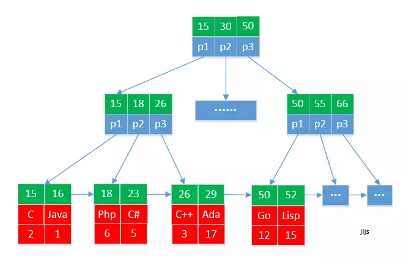
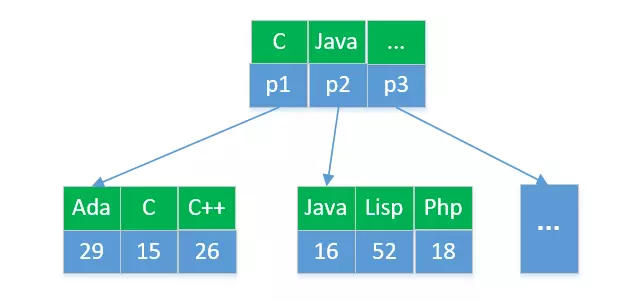

# 索引
## 聚簇索引和二级索引
聚簇索引索引和数据存储在一块（ 都存储在同一个B*tree 中），主键索引为聚簇索引。
非聚簇索引索引数据和存储数据是分离的。唯一索引、普通索引、前缀索引等都是二级索引（辅助索引）。

一个例子：pl_ranking（编程语言排行榜表）

| id  | plname  |  ranking 
|---|---|---|
|15	| C	| 2 |
|16	|Java |	1
|18	|Php  |	6
|23	|C#	  | 5
|26	|C++  | 3
|29	|Ada  |	17
|50	|Go   |	12
|52	|Lisp |	15

设置索引：
- id: 设置主键
- plname: 普通索引

主键索引存储 B-tree：


如果查找id=16的编程语言：
```
select id, plname, ranking from pl_ranking where id=16;
```
查找第一个块 16 位于 15 和 30 之间，定位到左边第一个块 P1. 再次查找，16 位于 15 和 18 之间，定位到左边第一个块 P1，发现是叶子节点，查找得到 id 16 的记录，整个过程需要读取三个块。

对于二级索引构造的 B-tree 如图：


例如查找 编程语言为“Java”的数据。
```
select id, plname, ranking from pl_ranking where plname='Java';
```
首先通过二级索引树中找到 Java 对应的主键id 为 “16”（读取2个磁盘块）。
然后在去主键索引中查找id为“16” 的数据。（读取3个磁盘块）。

通过上面的主键索引和非主键索引的例子我们可以得出：
- 主键索引（聚餐索引）查询效率比非主键索引查询效率更高。如果能使用主键查找的，就尽量使用主键索引进行查找。
- 主键定义的长度越小，二级索引的大小就越小，这样每个磁盘块存储的索引数据越多，查询效率就越高。