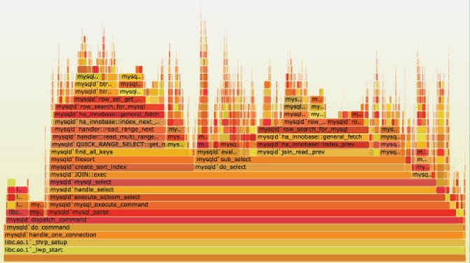

# 火焰图
日常开发中可能会遇到需要分析应用程序性能的场景，火焰图是一种很有效的性能分析工具，在linux下可以使用perf命令来分析c/c++编写程序运行情况。

```
sudo perf record -F 99 -p 13204 -g -- sleep 30
```
可以使用 -F 指定每秒记录的次数，-p 指定进程号，-g 表示记录调用栈，sleep 30 是持续时间。

而火焰图则是 perf 命令结果的可视化方式，用来展示 CPU 的调用栈。

y 轴表示调用栈，每一层都是一个函数。调用栈越深，火焰就越高，顶部就是正在执行的函数，下方都是它的父函数。

x 轴表示抽样数，如果一个函数在 x 轴占据的宽度越宽，就表示它被抽到的次数多，即执行的时间长。注意，x 轴不代表时间，而是所有的调用栈合并后，按字母顺序排列的。

火焰图就是看顶层的哪个函数占据的宽度最大。只要有"平顶"（plateaus），就表示该函数可能存在性能问题。颜色没有特殊含义，因为火焰图表示的是 CPU 的繁忙程度，所以一般选择暖色调。

perf 命令只适合 c/c++ 编写的程序，对于 JVM 平台可以使用 JDK 自带的FlightRecorder 功能。首先，应用启动的时候，要给 java 加上参数：

```
-XX:+UnlockCommercialFeatures -XX:+FlightRecorder -
XX:FlightRecorderOptions=loglevel=info
```
因为 JVM 默认在 safepoint 的地方才可以返回栈，所以最好加上

```
-XX:+UnlockDiagnosticVMOptions -XX:+DebugNonSafepoints
```
让 JVM 在非 safepoint 的时候也提供原数据。

然后在想开始采样的时候

```
jcmd <pid> JFR.start filename=/tmp/app.jfr duration=60s
```
这里可以指定输出的文件路径，和采样持续时间。之后可以用

```
jcmd <pid> JFR.check
```
来检查采样是不是已经完成了。完成后可以使用这个工具来生成火焰图: [jfr-flame-graph](https://github.com/chrishantha/jfr-flame-graph)。

```
cd jfr-flame-graph
install-mc-jars.sh
mvn clean install -U
```
需要maven和[FlameGraph](https://github.com/brendangregg/FlameGraph)的支持。

```
path/to/jfr-flame-graph/create_flamegraph.sh -f /tmp/app.jfr -i > flamegraph.svg
```
哒哒，完成了！


