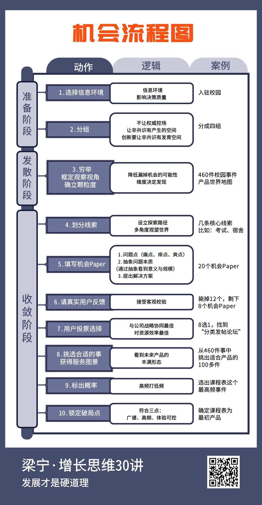

# 机会流程图
机会的特定：
 - 广谱 普遍有需求
 - 高频 需求次数多
 - 体验可控 能做到

# 爆品机会
技术/供应链创新 x 爆发品类 x 新流量
一边抓技术，提升品牌，一边开辟新的流量。
始于爆品 终于品牌 品牌就是护城河
品类不成熟的时候买品类，品类成熟的时候买品牌。

# 第二曲线
奈飞 20 年，用户需求没变（想方便地看到高质量的片子，打发时间）。企业基因没变，其实是外部限制性条件在变，（DVD 到在线视频）天花板在变（自制视频）。
每一个限制性条件发生变化的时候，都会产生新的市场空白。对行业来说，这就是风口，要求企业用完全不同的策略、产品、业务、在新条件下去持续满足用户需求。