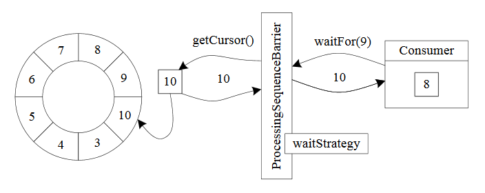
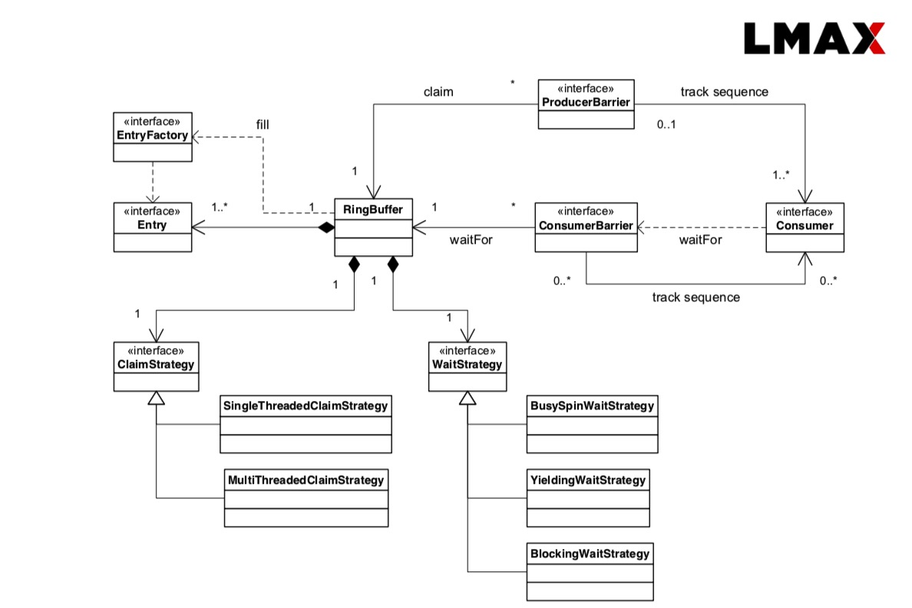
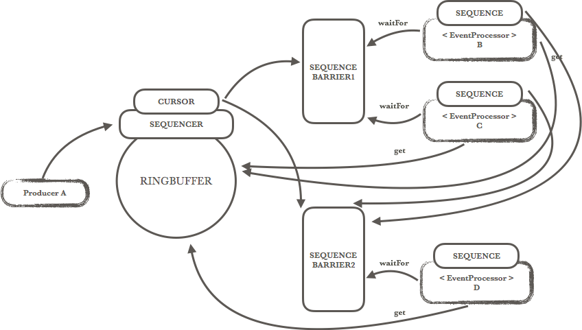

# Disruptor 庖丁解牛
Distruptor 是 LMAX 开源的一个高性能异步事件处理框架。LMAX 是一家期货交易所，交易所的业务可以简单抽象成一个事件队列，买卖双方都是事件的生产者，撮合引擎则是事件的消费者。Disruptor 就是这种背景下的产物。
## Ring Buffer
环形的缓冲区。曾经 RingBuffer 是 Disruptor 中的最主要的对象，但从3.0版本开始，其职责被简化为仅仅负责对通过 Disruptor 进行交换的数据（事件）进行存储和更新。在一些更高级的应用场景中，Ring Buffer 可以由用户的自定义实现来完全替代。Ring Buffer 为什么这么优秀，首先，因为它是数组，所以要比链表快，而且有一个容易预测的访问模式。（注：数组内元素的内存地址的连续性存储的）其次，你可以为数组预先分配内存，使得数组对象一直存在（除非程序终止）。这就意味着不需要花大量的时间用于垃圾回收。此外，不像链表那样，需要为每一个添加到其上面的对象创造节点对象—对应的，当删除节点时，需要执行相应的内存清理操作。

RingBuffer 示意代码：
```
public final class RingBuffer {
    private final Object[] entries; // Entry 数组
    protected final int bufferSize; // RingBuffer 大小
    protected final Sequencer sequencer; // 控制 producer 写入 RingBuffer
}
```

## Sequence
通过顺序递增的序号来编号管理通过其进行交换的数据（事件），对数据(事件)的处理过程总是沿着序号逐个递增处理。一个 Sequence 用于跟踪标识某个特定的事件处理者( RingBuffer/Consumer )的处理进度。虽然一个 AtomicLong 也可以用于标识进度，但定义 Sequence 来负责该问题还有另一个目的，那就是防止不同的 Sequence 之间的 CPU 缓存伪共享(Flase Sharing)问题。

## Sequencer 
Sequencer 是 Disruptor 的真正核心。此接口有两个实现类 SingleProducerSequencer、MultiProducerSequencer ，它们定义在生产者和消费者之间快速、正确地传递数据的并发算法。
Sequencer 最重要的实现是 MultiProducerSequencer.java:
```
    /**
     * @see Sequencer#next(int)
     * 用于多个 producer 同时向 ringbuffer 申请 entry
     */
    @Override
    public long next(int n)
    {
        if (n < 1 || n > bufferSize)
        {
            throw new IllegalArgumentException("n must be > 0 and < bufferSize");
        }

        long current;
        long next;

        do
        {
            // 获取当前可用的 entry 编号
            current = cursor.get();
            next = current + n;

            // 如果
            long wrapPoint = next - bufferSize;
            long cachedGatingSequence = gatingSequenceCache.get();

            if (wrapPoint > cachedGatingSequence || cachedGatingSequence > current)
            {
                long gatingSequence = Util.getMinimumSequence(gatingSequences, current);

                if (wrapPoint > gatingSequence)
                {
                    LockSupport.parkNanos(1); // TODO, should we spin based on the wait strategy?
                    continue;
                }

                gatingSequenceCache.set(gatingSequence);
            }
            else if (cursor.compareAndSet(current, next))
            {
                break;
            }
        }
        while (true);

        return next;
    }

```

## Sequence Barrier
消费者通过 SequenceBarrier 读取数据。RingBuffer 的元素的大小是2的n次方（下图中 ringBufferSize 为8，从序号0开始）。消费者通过访问 ProcessingSequenceBarrier 对象和 RingBuffer 进行交互。消费者也需要知道它将要处理的序号，每个消费者都需要找到下一个它要访问的序号。在下面的例子中，消费者处理完了 RingBuffer里序号8之前（包括8）的所有数据，那么它期待访问的下一个序号是9。



## Wait Strategy
定义 Consumer 如何进行等待下一个事件的策略。 （注：Disruptor 定义了多种不同的策略，针对不同的场景，提供了不一样的性能表现）

## Event
在 Disruptor 的语义中，生产者和消费者之间进行交换的数据被称为事件(Event)。它不是一个被 Disruptor 定义的特定类型，而是由 Disruptor 的使用者定义并指定。

## EventProcessor
EventProcessor 持有特定消费者(Consumer)的 Sequence，并提供用于调用事件处理实现的事件循环(Event Loop)。

## EventHandler
Disruptor 定义的事件处理接口，由用户实现，用于处理事件，是 Consumer 的真正实现。

## Producer
即生产者，只是泛指调用 Disruptor 发布事件的用户代码，Disruptor 没有定义特定接口或类型。

## 核心源码解析
```
// 创建 distruptor 实例
disruptor.handleEventsWith(EventStatusCheckHandler)
      .`then`(MessageTranslateHandler)
      .`then`(identityRequestHandler)
      .`then`(MessageIdentityResponseHandler)
      .`then`(EventRecordsHandler(topicManager))
      .`then`(eventPublishEvent)
      .`then`(EventStatusWriteHandler)
      .`then`(EventCleanHandler)
    disruptor.setDefaultExceptionHandler(EventExceptionHandler)

// 发布消息
disruptor.publishEvent(translator, message)
```
Disruptor 发布一个消息到 RingBuffer
```
public <A> void publishEvent(final EventTranslatorOneArg<T, A> eventTranslator, final A arg)
{
    ringBuffer.publishEvent(eventTranslator, arg);
}

//  RingBuffer 发布一个消息
public <A> void publishEvent(EventTranslatorOneArg<E, A> translator, A arg0)
{
    // 调用 Sequencer 获取下一个可用槽，多个 producer 的
    // 场景使用 MultiProducerSequencer
    final long sequence = sequencer.next(); 
    translateAndPublish(translator, sequence, arg0);
}
```
MultiProducerSequencer publish 方法
```
public void publish(final long sequence)
{
    setAvailable(sequence);
	 // 通过 waitStrategy 通知消费者
    waitStrategy.signalAllWhenBlocking();
}
```
WaitStrategy 的实现有多种 以 BlockingWaitStrategy 为例
```
// Sequencer 调用 signalAllWhenBlocking 方法
public void signalAllWhenBlocking()
{
     lock.lock();
     try
     {
        // 释放 condition
        processorNotifyCondition.signalAll();
    }
    finally
    {
        lock.unlock();
    }
}

// BlockingWaitStrategy 的 waitFor 方法
public long waitFor(long sequence, Sequence cursorSequence, Sequence dependentSequence, SequenceBarrier barrier)
    throws AlertException, InterruptedException
{
    long availableSequence;
    if (cursorSequence.get() < sequence)
    {
        lock.lock();
        try
        {
            while (cursorSequence.get() < sequence)
            {
               barrier.checkAlert();
					 // 持有 condition 等待释放信号 
                processorNotifyCondition.await();
            }
        }
        finally
        {
             lock.unlock();
        }
     }

	while ((availableSequence = dependentSequence.get()) < sequence)
	{
			barrier.checkAlert();
			ThreadHints.onSpinWait();
	}

	return availableSequence;
 }
```
WaitStrategy 的实际使用者是 SequenceBarrier，在 ProcessingSequenceBarrier 调用 waitStrategy 的 waitFor 方法。
```
public long waitFor(final long sequence)
	throws AlertException, InterruptedException, TimeoutException
{
	checkAlert();

	// 调用 strategy 的 waitFor 方法
	// 等待可用的消费事件
	long availableSequence = waitStrategy.waitFor(sequence, cursorSequence, dependentSequence, this);

	if (availableSequence < sequence)
	{
		return availableSequence;
	}

	return sequencer.getHighestPublishedSequence(sequence, availableSequence);
}
```

SequenceBarrier 是由消费者持有的，disruptor 定义了 EventProcessor 来描述消费者。BatchEventProcessor 本身是一个工作线程，在 run 方法里调用 processEvents 监听 ringBuffer 的可用事件。
```
private void processEvents()
{
	T event = null;
	long nextSequence = sequence.get() + 1L;

	while (true)
	{
		try
		{
			   // 调用 ProcessingSequenceBarrier 的 waitFor 方法
				final long availableSequence = sequenceBarrier.waitFor(nextSequence);
				if (batchStartAware != null)
				{
					batchStartAware.onBatchStart(availableSequence - nextSequence + 1);
				}

				while (nextSequence <= availableSequence)
				{
					// dataProvider 默认是 RingBuffer 实现
					event = dataProvider.get(nextSequence);
					// eventHandler 实际处理消息的消费者
					eventHandler.onEvent(event, nextSequence, nextSequence == availableSequence);
					nextSequence++;
				}

				sequence.set(availableSequence);
		}
		catch (final TimeoutException e)
		{
				notifyTimeout(sequence.get());
		}
		catch (final AlertException ex)
		{
				if (running.get() != RUNNING)
				{
					break;
				}
		}
		catch (final Throwable ex)
		{
				exceptionHandler.handleEventException(ex, nextSequence, event);
				sequence.set(nextSequence);
				nextSequence++;
		}
	}
}

```

## Disruptor 调用示意图
从上面的源代码中可以梳理出整个调用逻辑：

消费者：EventProcessor（BatchEventProcessor） -> SequenceBarrier.waitFor() ->  WaitStrategy.waitFor() 等待 waitFor 返回可以消费的信号 

生产者：Producer -> RingBuffer.publishEvent() -> Sequencer.next() 获取下一个可用的 cursor -> RingBuffer.translateAndPublish() -> Sequencer.publish() -> WaitStrategy.signalAllWhenBlocking() 通知消费者进行事件消费

下图是 LMAX paper 里提供的 UML 图：


另外如下图所示， SequenceBarrier 除了检测 RingBuffer 的 cursor 之外还可以检测其他 Consumer 的序号 Sequence，从而将最小的序号返回给消费者，由此实现了依赖的逻辑。




## 缓存伪共享(False Sharing)
数据在缓存中不是以独立的项来存储的，如不是一个单独的变量，也不是一个单独的指针。缓存是由缓存行组成的，通常是64字节（译注：这篇文章发表时常用处理器的缓存行是64字节的，比较旧的处理器缓存行是32字节），并且它有效地引用主内存中的一块地址。一个Java的long类型是8字节，因此在一个缓存行中可以存8个long类型的变量。非常奇妙的是如果你访问一个long数组，当数组中的一个值被加载到缓存中，它会额外加载另外7个。因此你能非常快地遍历这个数组。事实上，你可以非常快速的遍历在连续的内存块中分配的任意数据结构。

不过，所有这种免费加载有一个弊端。设想你的long类型的数据不是数组的一部分。设想它只是一个单独的变量。让我们称它为head，这么称呼它其实没有什么原因。然后再设想在你的类中有另一个变量紧挨着它。让我们直接称它为tail。现在，当你加载head到缓存的时候，你也免费加载了tail。tail正在被你的生产者写入，而head正在被你的消费者写入。这两个变量实际上并不是密切相关的，而事实上却要被两个不同内核中运行的线程所使用。设想你的消费者更新了head的值。缓存中的值和内存中的值都被更新了，而其他所有存储head的缓存行都会都会失效，因为其它缓存中head不是最新值了。现在如果一些正在其他内核中运行的进程只是想读tail的值，整个缓存行需要从主内存重新读取。那么一个和你的消费者无关的线程读一个和head无关的值，它被缓存未命中给拖慢了。

这叫作“伪共享”（译注：可以理解为错误的共享），因为每次你访问head你也会得到tail，而且每次你访问tail，你也会得到head。

## 缓存行填充
Disruptor 通过增加补全来确保ring buffer的序列号不会和其他东西同时存在于一个缓存行中。
```
public static final long INITIAL_CURSOR_VALUE = Sequence.INITIAL_VALUE;
protected long p1, p2, p3, p4, p5, p6, p7;
```
因此没有伪共享，就没有和其它任何变量的意外冲突，没有不必要的缓存未命中。