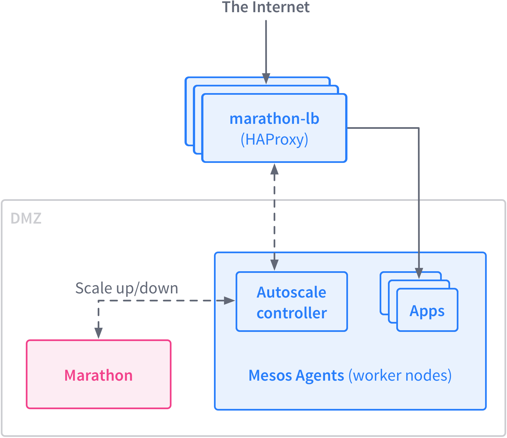
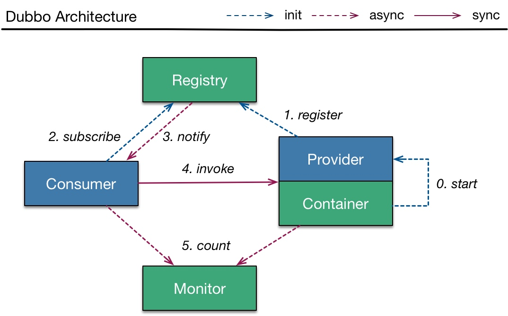

# 微服务之服务发现
微服务架构带来开发便利性的同时也带来了架构上的复杂性，极大的增加了运维成本。同时系统之间的调用也也成为一个很大的难题，服务调用需要考虑路由，负载均衡，熔断，降级等一些问题。服务发现和调用有很多方案可以做，但是总结起来就只有三种方式。

## 第一种：内部架设load balancer
这种模式最简单，通过在内部架设一个负载均衡器，所有内部请求走负载均衡。如果调用比较简单可以选择手工维护，如果服务比较多，调用比较复杂可以结合其他服务做到自动更新配置。比如使用openresty+consul，haproxy+marathon。这个方案最大优点就是简单，最大的缺点就是存在单点故障。

## 第二种：使用服务治理中心
这种模式相比第一种的好处在于消除了单点故障，服务治理中心可以做高可用，同时将繁重的路由工作放到了客户端，减轻了中心的压力。spring cloud，dubbo都是采用这种方案。这个方案最大的优点是消除了单点，最大的缺点是对客户端侵入性太强，需要在客户端做额外工作。

## 第三种：service mesh 服务网格
service mesh 的思路集合了前两种方案的一些优点，通过在pod或者node级别注入sider car来进行服务请求代理。比如下面是linkerd的架构图：

在每个pod/node注入linkerd，服务调用都通过linkerd来进行带来，linkerd通过一个注册中心来进行配置更新。这种方案最大的优点是没有单点，并且和具体的语言框架都没有耦合。缺点就是会有轻微的性能损耗，但是相对于方案本身带来的巨大便利来讲是可以忍受的。

## Service Mesh
Service mesh是一种相对较新的服务发现架构方案，目前主流的service mesh方案有以下几种：

* Linkerd：目前比较成熟的service mesh解决方案，已经有运用在生产环境的案例
* Istio：多家大型公司开源的service mesh解决方案，社区人气很高。
* Conduit：Linkerd 公司推出的第二代service mesh解决方案，使用go和rust编写。
* Envoy：Envoy是istio中默认的sider car，但是目前istio还没发布正式版本，所以有一些团队选择直接使用envoy加上自研的服务发现工具来达到service mesh的效果。

上述几个方案都能满足一般的服务发现需求，考虑成熟度使用Linkerd，或者直接使用envoy都是不错的选择。而istio因为有google等大公司的加持肯定是值得关注的。对于conduit而言，因为团队来自linkerd，或许能很好的利用之前成功的经验开辟一条不同的道路。

